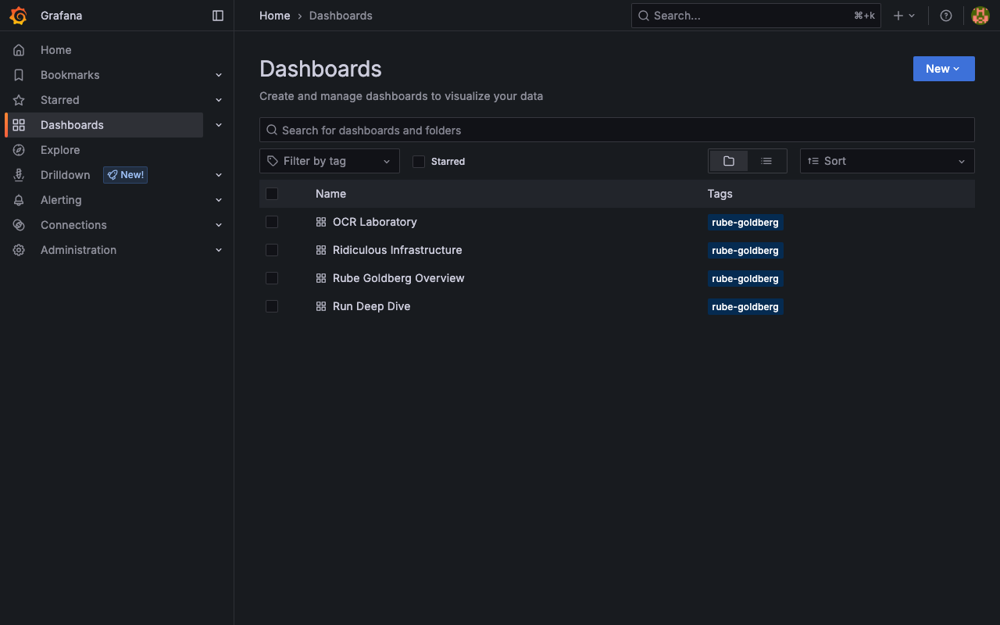
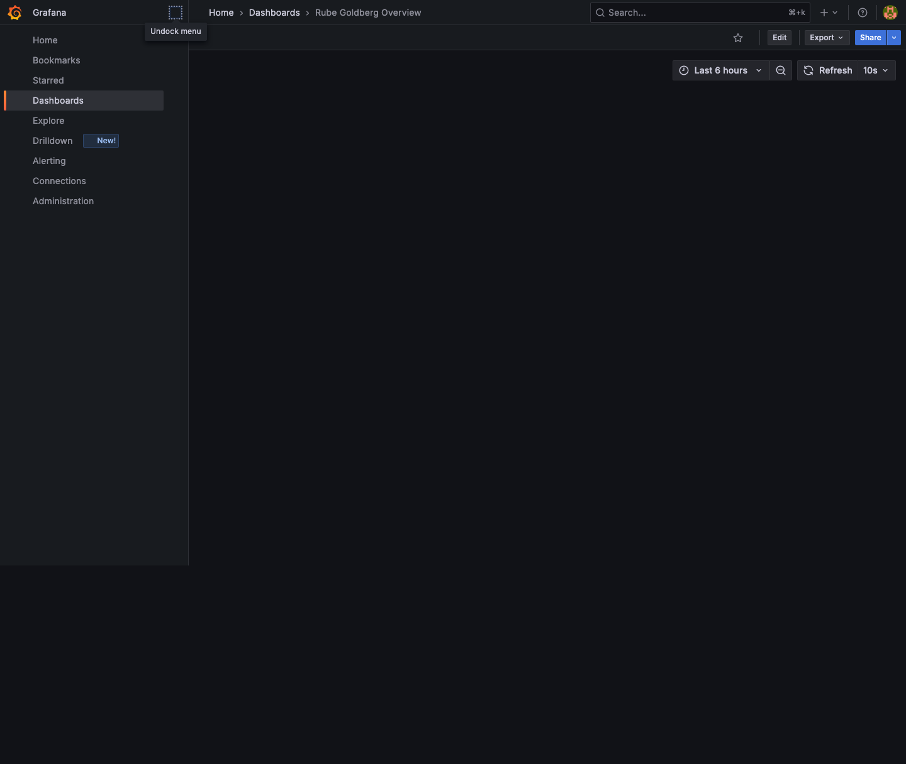
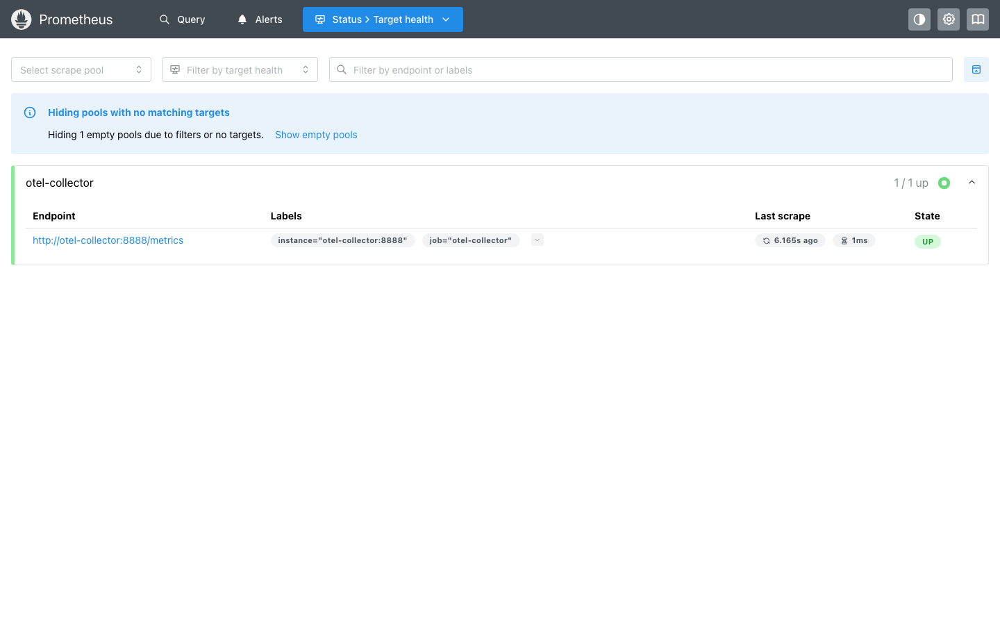
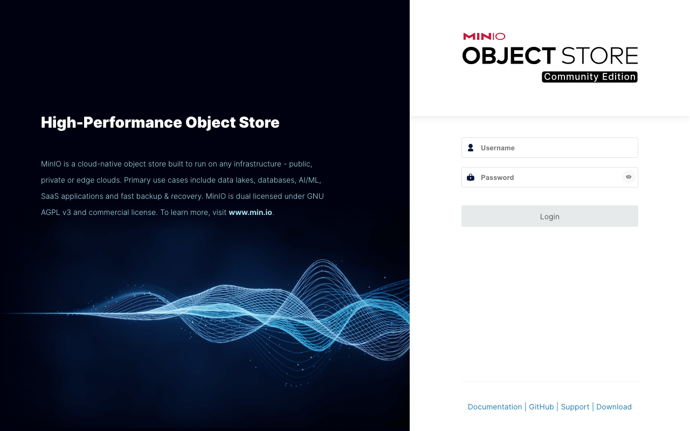

# Rube Goldberg Hello World

[](https://github.com/HyperVon/rg-helloworld/actions/workflows/ci.yml)

A deliberately excessive, fully local, event-driven distributed system whose sole
functional purpose is to derive, recognize, assemble, and print:

```text
HELLO WORLD
```

> **This project is intentionally *EXTRA*.** Fourteen services, nine languages, Kafka, Kubernetes, and a full observability stack — all to print one line — and the web UI and docs are *supposed* to look like a real product. First impression: “WOW that looks amazing.” Punchline: “Wait, it just does `HELLO WORLD`? WTF LOL.” See [docs/architecture.md#milestone-12-hardening-and-demonstration](docs/architecture.md#milestone-12-hardening-and-demonstration) and the screenshots below.

The acceptance phrase uses uppercase glyphs only: `HELLO WORLD`.

The project runs entirely on one laptop — no cloud account, no paid service, no
external runtime API. It exercises nine programming languages, REST, SOAP, gRPC,
Kafka, Redis Streams, PostgreSQL, MinIO, Kubernetes (k3d/k3s), and a complete
local observability stack (OpenTelemetry Collector, Prometheus, Loki, Tempo,
Grafana).

Works on **macOS** (Intel & Apple Silicon + Colima), **Linux** (Docker CE), and **Windows 10/11** (Docker Desktop + WSL2/Git Bash — `.\rghw.bat` delegates to `bash rghw.sh`). See [docs/runbook.md §2](docs/runbook.md#2-system-requirements--os-support) for RAM/disk/CPU and per-OS setup.

The final phrase is *derived*, not printed from memory:

```text
vector glyph blueprints
→ explicit line geometry
→ normalized SVG
→ raster images
→ composed phrase image
→ OCR observations
→ adjudicated symbols
→ assembled UTF-8
```

## Status

**Milestone 12 (Hardening and demonstration) is complete.**

The system now includes:

- Full pipeline: CLI → orchestrator → glyph catalog → geometry → rasterization → composition → OCR → adjudication → assembly → SSE
- 9 programming languages (Go, Kotlin, Java, C++, C#, Python, TypeScript, Ruby, Rust)
- Kafka, Redis Streams, PostgreSQL, MinIO, Kubernetes (k3d)
- OpenTelemetry tracing, Prometheus metrics, Grafana dashboards
- Whitespace provenance attestation and Brainfuck integrity guards
- Complete test suites, integration tests, e2e smoke tests
- Chaos testing, low-memory profiles, artifact cleanup, operational runbook, troubleshooting guide

See [docs/implementation-status.md](docs/implementation-status.md) for the
authoritative status and [docs/architecture.md](docs/architecture.md) for the
full architecture.

## System requirements

| Resource | Recommended | Minimum (low-memory) |
| --- | --- | --- |
| **RAM** | 16 GiB host (8 GiB to Colima/Docker) | 8 GiB host, 4 GiB to Colima (`colima start --memory 4`) — expect slower OCR |
| **CPU** | 4 vCPU (`--cpu 4`) | 2 vCPU |
| **Disk free** | **40 GiB** before `make images` | 20 GiB if you `docker system prune` after |
| **OS** | macOS 13+ (Intel/M1-M3), Linux Ubuntu 22.04+, Windows 10/11 + WSL2/Git Bash | — |

Repo `3.6GB` (`du -sh .`), built images `~21GB` virtual (`docker system df` 2026-08-08: `57` images, Local Volumes `17.66GB`). Full-stack working set `5–8 GiB` per `docs/architecture.md §21.5` (Kafka `512Mi→1Gi`, 12 app `32→384Mi` each). Detail: [runbook §2.1](docs/runbook.md#21-hardware--what-you-need-on-one-laptop) (`kubectl top` idle `~1.8 GiB`).

## Quick start

```bash
make prerequisites   # check toolchains and install language-level dependencies
make format          # format every language
make lint            # lint every language
make unit            # unit-test every service
make coverage        # unit tests + 90% coverage gates
make build           # compile everything
make integration     # cross-language artifact integration tests
make e2e             # full milestone acceptance (gates + integration)
make chaos           # chaos tests (Milestone 12)
make diagnostics     # collect stack diagnostics
```

All implemented gates (`format`, `lint`, `unit`, `coverage`, `build`,
`integration`, `e2e`) must pass before a milestone is considered complete.

Windows (PowerShell):

```powershell
choco install docker-desktop k3d kubernetes-cli terraform golang  # or winget
git clone https://github.com/HyperVon/rg-helloworld && cd rg-helloworld
.\rghw.bat --help          # delegates to bash rghw.sh if Git Bash is found
bash rghw.sh --help        # preferred in Git Bash / WSL2
```

> **User Guide (how to use every UI and app):** [docs/user-guide.md](docs/user-guide.md) — plain-English walkthrough of Web Shell, Artifact Inspector, Grafana/Prometheus/Loki/Tempo, MinIO, the CLI, and service `--once` modes.
>
> **Runbook (bring-up/operations):** [docs/runbook.md](docs/runbook.md) — `make cluster` / `make images` / `make infra` / `make wait` / `rghw run`, ingress vs port-forward, and every web UI.

### Running the demo

The simplest way — one script starts everything, runs the pipeline, and prints every URL. Works on Mac, Linux, and Windows (Git Bash/WSL):

```bash
./rghw.sh              # Linux / macOS: full bring-up + HELLO WORLD + URL table
.\rghw.bat             # Windows: same — delegates to bash rghw.sh when Git Bash/WSL is found
./rghw.sh --dry-run    # show what would be done and all web URLs
./rghw.sh --skip-images --skip-infra --open  # fast restart + open browser
./rghw.sh --quiet      # HELLO WORLD only on stdout (stderr suppressed)
./rghw.sh --fresh --quiet  # clean previous runs (Redis+MinIO, keeps Kafka), then HELLO WORLD
```

Or step-by-step:

```bash
make cluster && make images && make infra && make wait && make demo
# then
rghw run                          # prints HELLO WORLD to stdout
rghw run --api-url http://localhost:8080 --timeout 90s  # port-forward mode
kubectl port-forward -n rube-goldberg svc/web-shell 3000:3000 &      # Web Shell → http://localhost:3000
kubectl port-forward -n rube-goldberg svc/grafana 3002:3000 &        # Grafana  → http://localhost:3002
kubectl port-forward -n rube-goldberg svc/event-gateway 8081:8080 &  # SSE      → http://localhost:8081
```

See [docs/user-guide.md](docs/user-guide.md) for how to use each UI, and [docs/runbook.md §6](docs/runbook.md#6-web-uis-and-observability) / [§3](docs/runbook.md#3-host-names-and-ingress) for the full catalog and port-forward details. The `rghw.sh` scripts automate the port-forwards and print the same table after every run.

## Web UIs — the ridiculous punchline

> **WOW → WTF pipeline.** Eleven services, ten languages, Kafka on one laptop, and the full Grafana stack — all to print one line. Every screenshot below is captured via Playwright against a live `SUCCEEDED` run (`6dd077ad…`) after `./rghw.sh`.

### Web Shell (React Flow)

The flagship UI: dark gradient, glass-morphism header, auto-discovered run dropdown, live SSE stage graph (Run Planning → Terminal), success-particle overlay, and telemetry bar. No runId typing — it lists and auto-selects the latest run.


### Artifact Inspector (HTMX + Ruby/Sinatra)

Same EXTRA treatment: floating glass card, radial violet → cyan glow, live artifact table per run (`/inspector/runs/{runId}`) with SHA-256 and MinIO-backed previews.


### Grafana — four provisioned dashboards

`rg-overview` (Rube Goldberg Overview), `rg-infra` (Ridiculous Infrastructure), `rg-ocr-lab`, `rg-deep-dive` — provisioned via `infra/k8s/milestone11/grafana-dashboards.yaml` with `uid` and `datasource.yml`/`dashboard.yml` mounted as subPaths. All four appear in `http://localhost:3002/dashboards` without manual import.





Other dashboards (same EXTRA dark theme) include **Ridiculous Infrastructure**, **OCR Laboratory**, and **Run Deep Dive** — see the same `docs/screenshots/grafana-*.png` captures.

### Prometheus & the rest

| UI | URL (port-forward) | Screenshot |
| --- | --- | --- |
| Prometheus Query | `http://localhost:9090/` |  |
| Prometheus Targets | `http://localhost:9090/targets` |  |
| MinIO Console | `http://localhost:9001` |  |
| Orchestrator API | `http://localhost:8080/api/v1/runs` | `curl` above |
| Grafana (raw) | `http://localhost:3002` login (`admin`/`admin`) → Skip |  |

Full port-forward table (`svc:80` for web-shell, inspector, grafana, event-gateway; 9090, 3100, 3200, 9000/9001 for observability) and SSE replay (`Last-Event-ID`): **→ [docs/user-guide.md](docs/user-guide.md)** (usage) and **[docs/runbook.md §6](docs/runbook.md#6-web-uis-and-observability) §6.1.1** (ops).

> **Why EXTRA?** The whole joke is the gap. You open `http://localhost:3000` and it looks like a real production control plane — live graph, metrics, traces, dark glass — then you `go -C cmd/rghw run . run` and it prints `HELLO WORLD` in 8 seconds on one laptop. That’s Milestone 12’s requirement: the docs and UIs must provoke “WOW that looks amazing” followed by “Wait, it just does `HELLO WORLD`? WTF LOL.” See `docs/architecture.md` Milestone 12 EXTRA.

## Language ownership

| Language | Responsibility | Skeleton |
| --- | --- | --- |
| Go | CLI, vector normalizer | `cmd/rghw`, `services/vector-normalizer-go` |
| Kotlin | run orchestrator | `services/run-orchestrator-kotlin` |
| Java | SOAP glyph catalog | `services/glyph-catalog-java` |
| C++ | geometry expansion | `services/geometry-engine-cpp` |
| C#/.NET | gRPC rasterizer | `services/rasterizer-dotnet` |
| Python | phrase composition, OCR preprocessing | `services/image-pipeline-python` |
| TypeScript/Node.js | OCR worker, event gateway | `services/ocr-worker-node`, `services/event-gateway-node` |
| Ruby | OCR adjudicator, HTMX inspector | `services/adjudicator-ruby` |
| Rust | final phrase assembler | `services/phrase-assembler-rust` |

## Repository layout

```text
cmd/                 Go CLI binary (rghw)
services/            one directory per service, one language each
contracts/           OpenAPI, AsyncAPI, JSON Schema, protobuf, SOAP
infra/               k3d, Terraform, Helm values, Kubernetes manifests
tests/                contract, integration, end-to-end, chaos, anti-cheating
scripts/             prerequisites, build, smoke, diagnostics scripts
docs/                architecture, status, runbook, troubleshooting, ADRs
```

## Makefile interface

```text
make help            list targets
make prerequisites   check and prepare toolchains
make contracts       generate contracts from sources (Milestone 1)
make format          format all languages
make lint            lint all languages
make unit            run all unit tests
make coverage        unit tests + 90% coverage gates
make build           compile everything
make integration     cross-language integration tests
make images          build container images and push to the local registry
make cluster         create the k3d cluster
make infra           apply Terraform
make deploy          deploy applications (later milestone)
make wait            wait for readiness
make run             start a run via the CLI
make demo            full demonstration (later milestone)
make e2e             full milestone acceptance
make chaos           chaos tests
make diagnostics     collect diagnostics
make down            delete the k3d cluster (later milestone)
make destroy         delete the local environment (later milestone)
```

## Development notes

- All dependency and container versions are pinned; no floating `latest` tags.
  See `versions.env`, `global.json`, `rust-toolchain.toml`, and the per-language
  lockfiles.
- `make format`, `make lint`, `make unit`, `make coverage`, and `make build`
  skip a language when its toolchain is missing. Set `STRICT=1` to fail
  instead of skip (CI always runs strict).
- Documentation is kept current with every change: `docs/implementation-status.md`
  is the authoritative status, and behavior changes update the relevant
  service READMEs in the same change.
- Work is tracked milestone by milestone in
  [docs/implementation-status.md](docs/implementation-status.md).
- Architecture changes must be recorded as ADRs under `docs/adr/`.

## Tooling

This repository was scaffolded and milestone-tracked with the help of AI
coding agents:

- Scaffold harness: KiloCode (Kilo CLI) — `opencode-go/deepseek-v4-flash` (2026-08-04)
- Hardening and operationalization: **Muse Code powered by Meta Muse Spark** — `muse-spark-1.2-contributor` (xhigh) — runbook expansion, web UI documentation, CI restoration (Go/Docs/C++/Python/Shell/Node/Rust coverage), adjudicator threshold alignment, and low-memory profile hardening (2026-08-08)

Agent guidance is split by purpose: `AGENTS.md` is canonical for invariants and
skill routing, while `.kilo/operating.md` is canonical for portable always-on
norms. Harness-specific copies live in `CLAUDE.md`,
`.github/copilot-instructions.md`, `.cursor/rules/`, `.windsurfrules`, and
`.kilo/` (commands, agents, skills).

## License

Apache-2.0 — see [LICENSE](LICENSE).
