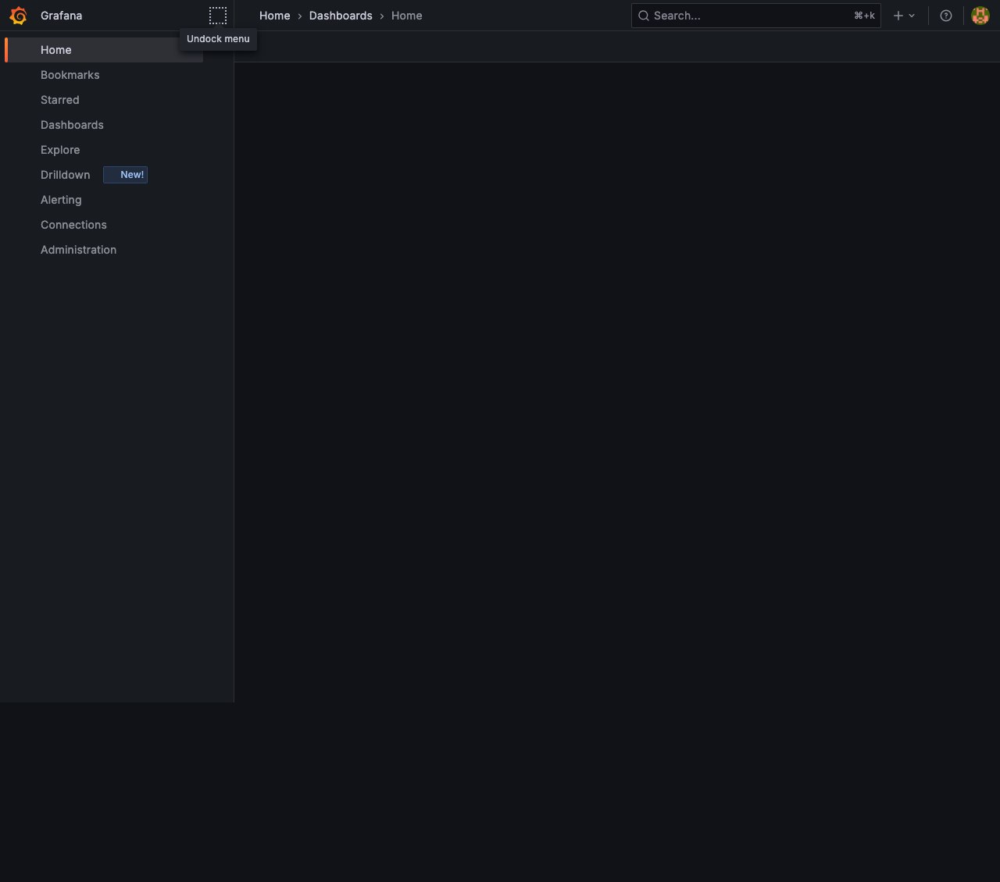

# Rube Goldberg Hello World

[](https://github.com/rube-goldberg-hello-world/rube-goldberg-hello-world/actions/workflows/ci.yml)

A deliberately excessive, fully local, event-driven distributed system whose sole
functional purpose is to derive, recognize, assemble, and print:

```text
HELLO WORLD
```

> **This project is intentionally *EXTRA*.** Eleven services, ten languages, Kafka, Kubernetes, and a full observability stack — all to print one line — and the web UI and docs are *supposed* to look like a real product. First impression: “WOW that looks amazing.” Punchline: “Wait, it just does `HELLO WORLD`? WTF LOL.” See [docs/architecture.md#milestone-12-hardening-and-demonstration](docs/architecture.md#milestone-12-hardening-and-demonstration) and the screenshots below.

The acceptance phrase uses uppercase glyphs only: `HELLO WORLD`.

The project runs entirely on one laptop — no cloud account, no paid service, no
external runtime API. It exercises ten programming languages, REST, SOAP, gRPC,
Kafka, Redis Streams, PostgreSQL, MinIO, Kubernetes (k3d/k3s), and a complete
local observability stack (OpenTelemetry Collector, Prometheus, Loki, Tempo,
Grafana).

The final phrase is *derived*, not printed from memory:

```text
vector glyph blueprints
→ explicit line geometry
→ normalized SVG
→ raster images
→ composed phrase image
→ OCR observations
→ adjudicated symbols
→ assembled UTF-8
```

## Status

**Milestone 12 (Hardening and demonstration) is complete.**

The system now includes:

- Full pipeline: CLI → orchestrator → glyph catalog → geometry → rasterization → composition → OCR → adjudication → assembly → SSE
- 10 programming languages (Go, Kotlin, Java, C++, C#, Python, TypeScript, Ruby, Rust)
- Kafka, Redis Streams, PostgreSQL, MinIO, Kubernetes (k3d)
- OpenTelemetry tracing, Prometheus metrics, Grafana dashboards
- Whitespace provenance attestation and Brainfuck integrity guards
- Complete test suites, integration tests, e2e smoke tests
- Chaos testing, low-memory profiles, artifact cleanup, operational runbook, troubleshooting guide

See [docs/implementation-status.md](docs/implementation-status.md) for the
authoritative status and [docs/architecture.md](docs/architecture.md) for the
full architecture.

## Quick start

```bash
make prerequisites   # check toolchains and install language-level dependencies
make format          # format every language
make lint            # lint every language
make unit            # unit-test every service
make coverage        # unit tests + 90% coverage gates
make build           # compile everything
make integration     # cross-language artifact integration tests
make e2e             # full milestone acceptance (gates + integration)
make chaos           # chaos tests (Milestone 12)
make diagnostics     # collect stack diagnostics
```

All implemented gates (`format`, `lint`, `unit`, `coverage`, `build`,
`integration`, `e2e`) must pass before a milestone is considered complete.

> **To start the full stack and view web UIs:** see [docs/runbook.md](docs/runbook.md) — it covers `make cluster` / `make images` / `make infra` / `make wait` / `rghw run`, ingress vs port-forward, and every web UI (Web Shell React Flow, Artifact Inspector HTMX, Event Gateway SSE, Grafana/Prometheus/Loki/Tempo, OTel Collector, MinIO).

### Running the demo

The simplest way — one script starts everything, runs the pipeline, and prints every URL:

```bash
./rghw.sh              # Linux / macOS: full bring-up + HELLO WORLD + URL table
.\rghw.bat            # Windows: same (delegates to bash if available)
./rghw.sh --dry-run    # show what would be done and all web URLs
./rghw.sh --skip-images --skip-infra --open  # fast restart + open browser
```

Or step-by-step:

```bash
make cluster && make images && make infra && make wait && make demo
# then
rghw run                          # prints HELLO WORLD to stdout
rghw run --api-url http://localhost:8080 --timeout 90s  # port-forward mode
kubectl port-forward -n rube-goldberg svc/web-shell 3000:3000 &      # Web Shell → http://localhost:3000
kubectl port-forward -n rube-goldberg svc/grafana 3002:3000 &        # Grafana  → http://localhost:3002
kubectl port-forward -n rube-goldberg svc/event-gateway 8081:8080 &  # SSE      → http://localhost:8081
```

See [docs/runbook.md §6](docs/runbook.md#6-web-uis-and-observability) for the full UI catalog and [docs/runbook.md §3](docs/runbook.md#3-host-names-and-ingress) for `rghw.localhost` vs port-forward. The `rghw.sh`/`rghw.bat` scripts automate the port-forwards and print the same table after every run.

## Web UIs — the ridiculous punchline

> **WOW → WTF pipeline.** Eleven services and the full Grafana stack to print one line. Every UI below is captured via Playwright against a live `SUCCEEDED` run (`69bce0a2…`).

| UI | What you see | Screenshot |
| --- | --- | --- |
| **Web Shell** (React Flow) | Auto-discovered runs, live SSE graph, success particles |  |
| **Artifact Inspector** | HTMX form at `/` → per-run gallery |  |
| **Grafana** | Login then 4 provisioned dashboards (Overview, Deep Dive, OCR Lab, Ridiculous Infra) |   |

Full catalog with 8 screenshots, port-forwards (`svc:80`), and `Last-Event-ID` replay details: **→ [docs/runbook.md §6.1.1](docs/runbook.md#611-web-shell--auto-select-and-screenshots)**.

> The stack is *intentionally extra* — dark gradients, glass cards, and theatrical success animation — so the first impression is “this looks like a real product” and the reveal is “it just prints `HELLO WORLD`.” See `docs/architecture.md` Milestone 12 EXTRA requirement.

## Language ownership

| Language | Responsibility | Skeleton |
| --- | --- | --- |
| Go | CLI, vector normalizer | `cmd/rghw`, `services/vector-normalizer-go` |
| Kotlin | run orchestrator | `services/run-orchestrator-kotlin` |
| Java | SOAP glyph catalog | `services/glyph-catalog-java` |
| C++ | geometry expansion | `services/geometry-engine-cpp` |
| C#/.NET | gRPC rasterizer | `services/rasterizer-dotnet` |
| Python | phrase composition, OCR preprocessing | `services/image-pipeline-python` |
| TypeScript/Node.js | OCR worker, event gateway | `services/ocr-worker-node`, `services/event-gateway-node` |
| Ruby | OCR adjudicator, HTMX inspector | `services/adjudicator-ruby` |
| Rust | final phrase assembler | `services/phrase-assembler-rust` |

## Repository layout

```text
cmd/                 Go CLI binary (rghw)
services/            one directory per service, one language each
contracts/           OpenAPI, AsyncAPI, JSON Schema, protobuf, SOAP
infra/               k3d, Terraform, Helm values, Kubernetes manifests
tests/                contract, integration, end-to-end, chaos, anti-cheating
scripts/             prerequisites, build, smoke, diagnostics scripts
docs/                architecture, status, runbook, troubleshooting, ADRs
```

## Makefile interface

```text
make help            list targets
make prerequisites   check and prepare toolchains
make contracts       generate contracts from sources (Milestone 1)
make format          format all languages
make lint            lint all languages
make unit            run all unit tests
make coverage        unit tests + 90% coverage gates
make build           compile everything
make integration     cross-language integration tests
make images          build container images and push to the local registry
make cluster         create the k3d cluster
make infra           apply Terraform
make deploy          deploy applications (later milestone)
make wait            wait for readiness
make run             start a run via the CLI
make demo            full demonstration (later milestone)
make e2e             full milestone acceptance
make chaos           chaos tests
make diagnostics     collect diagnostics
make down            scale workloads down (later milestone)
make destroy         delete the local environment (later milestone)
```

## Development notes

- All dependency and container versions are pinned; no floating `latest` tags.
  See `versions.env`, `global.json`, `rust-toolchain.toml`, and the per-language
  lockfiles.
- `make format`, `make lint`, `make unit`, `make coverage`, and `make build`
  skip a language when its toolchain is missing. Set `STRICT=1` to fail
  instead of skip (CI always runs strict).
- Documentation is kept current with every change: `docs/implementation-status.md`
  is the authoritative status, and behavior changes update the relevant
  service READMEs in the same change.
- Work is tracked milestone by milestone in
  [docs/implementation-status.md](docs/implementation-status.md).
- Architecture changes must be recorded as ADRs under `docs/adr/`.

## Tooling

This repository was scaffolded and milestone-tracked with the help of AI
coding agents:

- Scaffold harness: KiloCode (Kilo CLI) — `opencode-go/deepseek-v4-flash` (2026-08-04)
- Hardening and operationalization: **Muse Code powered by Meta Muse Spark** — `muse-spark-1.2-contributor` (xhigh) — runbook expansion, web UI documentation, CI restoration (Go/Docs/C++/Python/Shell/Node/Rust coverage), adjudicator threshold alignment, and low-memory profile hardening (2026-08-08)

Agent guidance lives in `AGENTS.md` (canonical), with harness-specific copies
in `CLAUDE.md`, `.github/copilot-instructions.md`, `.cursor/rules/`,
`.windsurfrules`, and `.kilo/` (commands, agents, skills).

## License

Apache-2.0 — see [LICENSE](LICENSE).
