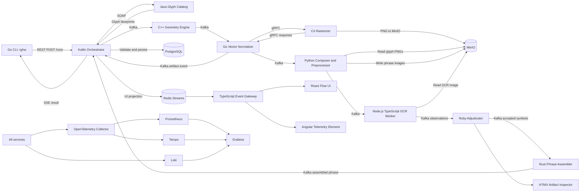
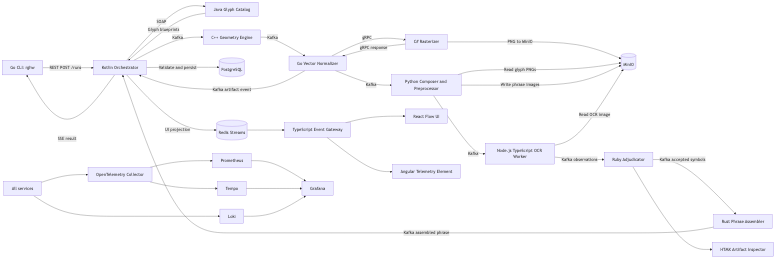
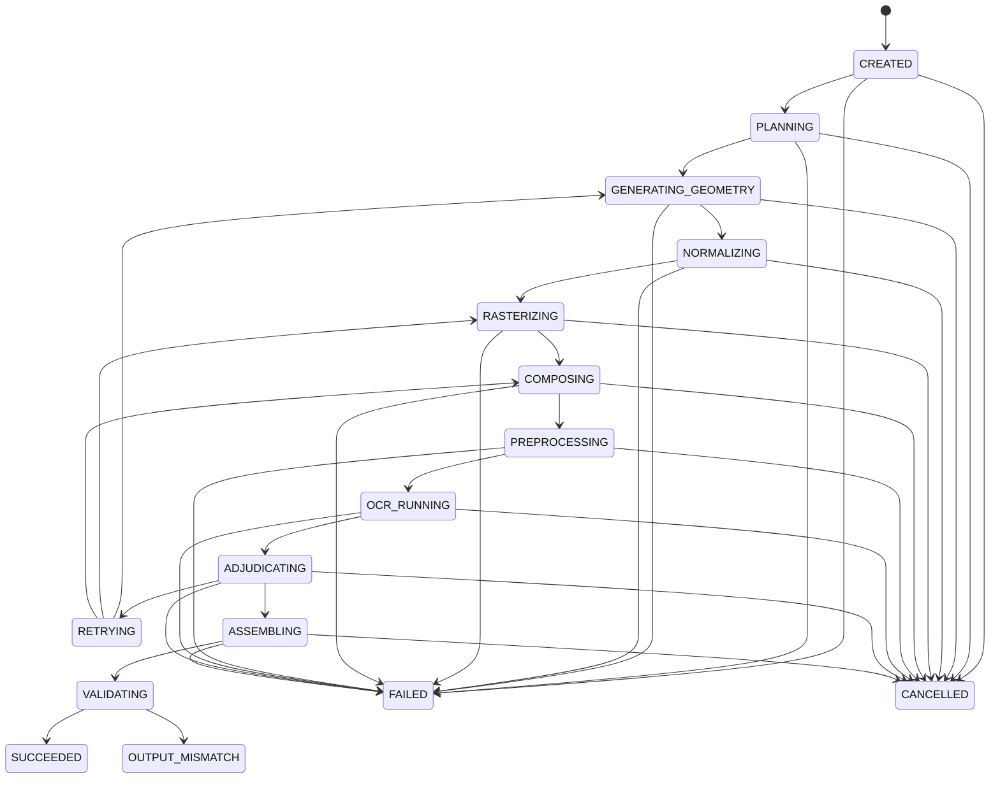
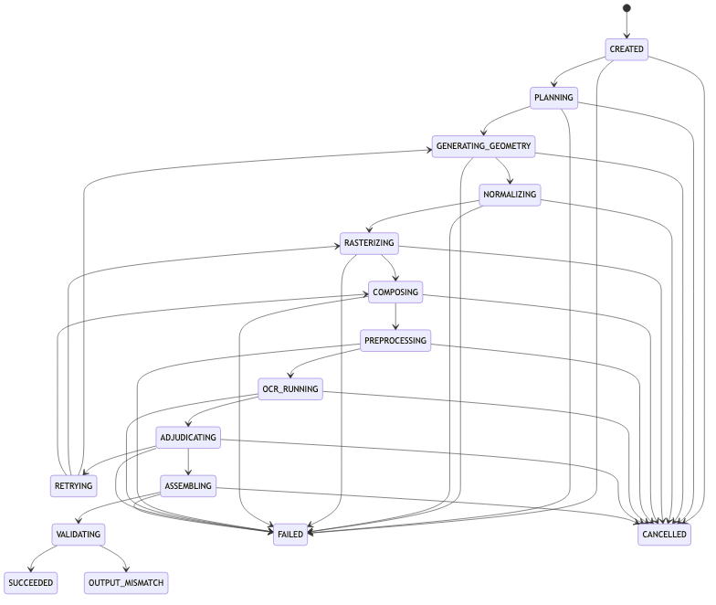

# Rube Goldberg rghw

## Implementation and Architecture Specification

**Working project name:** `rube-goldberg-hello-world`  
**CLI name:** `rghw`  
**Primary acceptance command:**

```bash
rghw run
```

**Required final standard output:**

```text
HELLO WORLD
```

The command may print progress messages to standard error, but standard output must contain only the completed phrase followed by a newline.

---

# 1. Project Objective

Build a deliberately excessive distributed system whose sole functional purpose is to derive, recognize, assemble, and print:

```text
HELLO WORLD
```

The system must:

1. Run entirely on one laptop.
2. Require no paid services or external APIs.
3. Use Docker and a local Kubernetes cluster.
4. Exercise all required programming languages.
5. Exercise REST, SOAP, gRPC, Kafka, Redis, relational storage, NoSQL storage, a web UI, and a full local observability stack.
6. Transform real data at every pipeline stage.
7. Produce the final text from generated visual artifacts and OCR results.
8. Avoid printing a hard-coded copy of `"HELLO WORLD"` at the end.
9. Remain sufficiently deterministic that the demonstration succeeds reliably.
10. Shut down the CLI process after printing the result.

The system is intentionally ludicrous, but it must not be fake.

---

# 2. The Fundamental Rule: No Decorative Pipeline Stages

Every stage in the primary processing graph must satisfy at least one of these conditions:

- Change the representation of the message.
- Increase the amount of usable information.
- Increase confidence in the derived result.
- Combine independently generated artifacts.
- Validate that an artifact can advance to the next representation.
- Deliver the final derived result to the user.

Observability, infrastructure, UI projection, and logging are not considered transformation stages. They are supporting systems and should be displayed separately from the primary data-transformation path.

## 2.1 Monotonic artifact maturity

Every primary artifact has a maturity rank:

| Rank | Artifact |
| ---: | --- |
| 0 | Run request |
| 10 | Glyph blueprint |
| 20 | Raw geometric segments |
| 30 | Normalized vector glyph |
| 40 | Rasterized glyph image |
| 50 | Composed phrase image |
| 60 | OCR-prepared phrase image |
| 70 | Raw OCR observations |
| 80 | Adjudicated symbols |
| 90 | Assembled UTF-8 phrase |
| 100 | Validated console result |

A completed transformation event must:

- Reference at least one input artifact.
- Produce at least one output artifact.
- Produce an artifact with a higher maturity rank.
- Include the SHA-256 hash of each input and output.
- Include the name and version of the transformation.
- Include the run ID, step ID, attempt number, and distributed trace context.

The orchestrator must reject events that claim to move backward or remain at the same maturity rank.

This prevents a worker from pretending to make progress by republishing its input unchanged.

---

# 3. Recommended Technology Choices

Use **k3d** as the local Kubernetes environment. It runs k3s nodes inside Docker containers and is intended for local Kubernetes development, making it a better laptop-oriented choice than a heavyweight multi-VM cluster. citeturn196864search0

Use actual **Apache Kafka** in single-node KRaft mode rather than replacing it with a Kafka-compatible alternative. Apache Kafka supports running locally from its distribution or Docker image. citeturn991095search0

Use **Terraform** after cluster bootstrap to manage Kubernetes resources and Helm installations. Terraform has official Kubernetes and Helm provider workflows, while the k3d cluster itself should be created by a small deterministic shell script to avoid a circular provider-bootstrap problem. citeturn991095search2turn991095search14

Use **Redis Streams** for the low-latency UI projection feed. Redis Streams support consumer groups, acknowledgements, pending entries, and replay, which gives the browser event gateway different behavior from the durable Kafka domain-event pipeline. citeturn196864search5turn196864search10

Use **OpenTelemetry Collector** as the common telemetry intake point. It can receive telemetry from heterogeneous services and route it to the selected tracing, metrics, and logging backends. citeturn196864search17

Use the local Grafana ecosystem:

- Prometheus for metrics.
- Loki for logs.
- Tempo for distributed traces.
- Grafana for visualization and correlation.

Tempo is designed as a distributed tracing backend and integrates with OpenTelemetry, Prometheus, and Loki. Loki focuses on log aggregation while indexing log metadata rather than full log contents. citeturn991095search1turn991095search4

Use **React Flow** for the main process graph. It provides node-based interaction primitives such as custom nodes, edges, zooming, panning, and selection. citeturn991095search3

---

# 4. User Experience

## 4.1 Initial setup

The complete initial demonstration should be available through:

```bash
make demo
```

`make demo` performs:

1. Tool prerequisite checks.
2. Local Docker registry creation.
3. k3d cluster creation if it does not exist.
4. Container image builds.
5. Image pushes into the local registry.
6. Terraform initialization and apply.
7. Kubernetes readiness checks.
8. Execution of `rghw run`.
9. Printing of `HELLO WORLD`.
10. Display of the dashboard address on standard error.

After the environment exists, subsequent executions use:

```bash
rghw run
```

## 4.2 CLI behavior

Default command:

```bash
rghw run
```

Equivalent explicit command:

```bash
rghw run --message "HELLO WORLD"
```

Useful options:

```text
--message TEXT           Input phrase; defaults to "HELLO WORLD"
--api-url URL            Orchestrator base URL
--timeout DURATION       Maximum wait; defaults to 3m
--quiet                  Suppress progress on stderr
--open-ui                Open the browser dashboard
--retain-artifacts       Prevent automatic run-artifact cleanup
--json                   Return a machine-readable result instead of plain text
--run-id UUID            Reattach to an existing run
```

Normal execution:

```text
stderr: [01/10] Creating run...
stderr: [02/10] Planning glyphs...
stderr: [03/10] Expanding geometric primitives...
stderr: [04/10] Normalizing vectors...
stderr: [05/10] Rasterizing glyphs...
stderr: [06/10] Composing phrase image...
stderr: [07/10] Preparing OCR image...
stderr: [08/10] Running OCR...
stderr: [09/10] Adjudicating symbols...
stderr: [10/10] Assembling UTF-8 output...
stdout: HELLO WORLD
```

Exit codes:

| Code | Meaning |
| ---: | --- |
| 0 | Successful output |
| 1 | Unexpected system failure |
| 2 | Invalid request |
| 3 | Timeout |
| 4 | OCR failed after all quality retries |
| 5 | Final output did not equal the requested message |
| 130 | User cancellation |

## 4.3 Standard-stream contract

This must be strictly enforced:

- Progress, warnings, URLs, run IDs, and diagnostic output go to `stderr`.
- Only the completed phrase goes to `stdout`.
- A successful run ends with exactly one newline.
- A failed run must not print a partial phrase to `stdout`.

This allows:

```bash
RESULT="$(rghw run)"
test "$RESULT" = "HELLO WORLD"
```

---

# 5. High-Level Architecture





> **Note:** If you update the diagram above, regenerate the image with:
> `mmdc -i docs/diagrams/high-level-architecture.mmd -o docs/diagrams/high-level-architecture.png`

---

# 6. Primary Processing Pipeline

The default run fans out by glyph, processes glyphs independently, then fans back in when composing the phrase image.

For `"Hello World"` there are eleven positions:

```text
0 H
1 e
2 l
3 l
4 o
5 gap
6 W
7 o
8 r
9 l
10 d
```

The gap is a real layout artifact with a calculated width. It is not treated as an ignored character.

## Stage 1: Run creation and phrase planning

**Owner:** Kotlin orchestrator and Java SOAP glyph catalog  
**Input:** UTF-8 user request  
**Output:** Ordered glyph-blueprint artifacts

The orchestrator:

1. Validates that the message is valid UTF-8.
2. Stores the original requested text in PostgreSQL.
3. Creates a run record.
4. Opens the root OpenTelemetry span.
5. Sends a SOAP `PlanPhrase` request to the Java glyph-catalog service.
6. Stores the expected code points privately.
7. Emits one glyph-blueprint command per phrase position.

The SOAP service:

1. Decodes the phrase into Unicode code points.
2. Assigns each position an opaque `glyph_instance_id`.
3. Retrieves a vector blueprint for every drawable glyph.
4. Produces a gap blueprint for whitespace.
5. Returns abstract drawing primitives.

Example abstract blueprint:

```json
{
  "glyphInstanceId": "01J...H0",
  "position": 0,
  "kind": "DRAWABLE",
  "advanceWidth": 1.0,
  "baseline": 0.0,
  "primitives": [
    {"kind": "LINE", "from": [0.1, 0.0], "to": [0.1, 1.0]},
    {"kind": "LINE", "from": [0.9, 0.0], "to": [0.9, 1.0]},
    {"kind": "LINE", "from": [0.1, 0.5], "to": [0.9, 0.5]}
  ]
}
```

The response returned to the orchestrator may include code points. Events sent to downstream workers must not.

### Glyph design

Implement an internal vector alphabet named:

```text
RUBE_SIMPLEX_V1
```

Initially implement only:

```text
H e l o W r d SPACE
```

Curves are represented as polylines composed entirely of straight line segments.

Examples:

- `H`: three straight lines.
- `e`: polygonal loop plus an interior horizontal stroke.
- `l`: vertical line and short baseline.
- `o`: a 16- or 24-sided polygon.
- `W`: four diagonal lines.
- `r`: vertical line, shoulder polyline, and short diagonal.
- `d`: vertical ascender plus polygonal bowl.
- `SPACE`: a gap artifact containing advance width but no drawing segments.

Do not depend on a system font for the default path. Keeping the initial glyph definitions in the repository makes rendering deterministic across operating systems.

## Stage 2: Geometric expansion

**Owner:** C++ geometry engine  
**Input:** Abstract glyph blueprint  
**Output:** Explicit geometric segment artifact

The C++ service consumes glyph-blueprint events.

It must:

1. Convert abstract primitives into explicit line segments.
2. Approximate any arc or quadratic curve with configurable line subdivisions.
3. Validate finite coordinates.
4. Remove zero-length segments.
5. Merge exactly collinear adjacent segments where doing so preserves shape.
6. Calculate:
    - Bounding box.
    - Total segment count.
    - Total path length.
    - Intersection count.
    - Geometry checksum.
7. Write a JSON geometry artifact to MinIO.
8. Publish `GeometryExpanded`.

A gap artifact progresses by becoming an explicit layout segment record:

```json
{
  "kind": "GAP_GEOMETRY",
  "advanceWidth": 0.65,
  "leftBearing": 0.0,
  "rightBearing": 0.0
}
```

It is therefore not skipped.

## Stage 3: Vector normalization and SVG construction

**Owner:** Go vector-normalizer service  
**Input:** Explicit geometry  
**Output:** Normalized vector artifact and SVG

The normalizer:

1. Translates all coordinates into positive canvas space.
2. Scales each glyph into a standard em-square.
3. Preserves aspect ratio.
4. Aligns the glyph to a common baseline.
5. Applies standard side bearings.
6. Quantizes floating-point coordinates to a fixed precision.
7. Generates deterministic SVG.
8. Calculates the SVG SHA-256.
9. Stores:
    - Normalized JSON geometry.
    - SVG artifact.
    - Layout metadata.
10. Calls the C# rasterizer over gRPC.

The SVG should use only line or polyline elements. It must not contain text elements or embedded font glyphs.

## Stage 4: Glyph rasterization

**Owner:** C#/.NET rasterizer  
**Transport:** gRPC  
**Input:** Normalized segments  
**Output:** Rasterized glyph PNG

The service uses SkiaSharp or an equivalent local rendering library.

It must:

1. Create a transparent or white canvas.
2. Draw normalized line segments using:
    - Rounded line caps.
    - Configurable antialiasing.
    - Configurable stroke width.
3. Render at an initial high resolution, such as 512×512.
4. Crop to meaningful bounds while retaining OCR margin.
5. Write PNG bytes to MinIO.
6. Return:
    - Artifact URI.
    - Width and height.
    - SHA-256.
    - Actual render profile.
    - Pixel-density metadata.

The service must not receive:

- The original phrase.
- The expected character.
- The Unicode code point.

It receives only geometric segments and opaque identifiers.

## Stage 5: Phrase composition

**Owner:** Python image pipeline  
**Input:** All rasterized glyph images and layout-gap records  
**Output:** Raw phrase image

This is the first run-level fan-in stage.

The orchestrator schedules it only when:

- Every drawable glyph has a successful raster image.
- Every gap position has layout metadata.
- No position is missing.

The Python service:

1. Retrieves all glyph images from MinIO.
2. Sorts them by phrase position.
3. Aligns them to the baseline.
4. Applies stored advance widths.
5. Inserts gap widths from gap artifacts.
6. Adds phrase-level margins.
7. Creates a single horizontal phrase PNG.
8. Writes a composition manifest mapping each phrase position to a pixel bounding box.
9. Stores the raw phrase image and manifest in MinIO.
10. Publishes `PhraseComposed`.

The manifest contains opaque positions but no expected characters.

## Stage 6: OCR preprocessing

**Owner:** Python image pipeline  
**Input:** Raw phrase image  
**Output:** OCR-prepared image

This is a distinct transformation from composition.

The service:

1. Converts to grayscale.
2. Increases contrast.
3. Applies an adaptive or deterministic threshold.
4. Removes isolated noise.
5. Adds a clean border.
6. Optionally scales the image by an integer factor.
7. Produces both:
    - A full-phrase OCR image.
    - Individual position crops derived from the composition manifest.
8. Writes an OCR preprocessing report containing:
    - Threshold.
    - Scale.
    - Estimated foreground ratio.
    - Connected-component count.
9. Stores all outputs in MinIO.
10. Publishes `OcrImagePrepared`.

The individual crops support an independent OCR path without revealing the expected character.

## Stage 7: Dual-mode OCR

**Owner:** TypeScript/Node.js OCR worker  
**Input:** Full phrase image and position crops  
**Output:** Raw OCR observations

Use Tesseract.js or a locally packaged Tesseract engine. No external OCR API is permitted.

Run two independent recognition modes:

### Mode A: Full phrase recognition

Recognize the phrase as a line of text and return:

- Raw recognized string.
- Word boxes.
- Symbol boxes.
- Confidence values.
- Alternative candidates where available.

### Mode B: Per-position recognition

For every drawable position crop:

- Recognize one symbol.
- Use an allowed alphabet of printable characters, not a single expected character.
- Return candidate symbols and confidence values.

For gaps:

- Estimate whitespace from the full-image bounding-box separation.
- Do not receive an explicit instruction to output a space.

The OCR artifact:

```json
{
  "fullPhrase": {
    "rawText": "Hello World",
    "confidence": 93.2,
    "symbols": []
  },
  "positionObservations": [
    {
      "position": 0,
      "candidate": "H",
      "confidence": 96.1,
      "alternatives": ["H", "N"]
    }
  ],
  "spacingObservations": [
    {
      "betweenPositions": [4, 6],
      "pixelGap": 94,
      "medianGlyphGapRatio": 3.1
    }
  ]
}
```

The OCR worker must not compare its output to the requested phrase.

## Stage 8: Symbol adjudication

**Owner:** Ruby adjudicator  
**Input:** Raw OCR observations  
**Output:** Accepted symbols and accepted gaps

The Ruby service performs deterministic consensus analysis.

For each drawable position:

1. Compare the full-phrase symbol observation with the crop observation.
2. Accept when:
    - Both agree and one exceeds the minimum confidence; or
    - One is highly confident and geometrically aligned to the expected position box.
3. Reject ambiguous observations.
4. Preserve exact case from OCR.
5. Never replace a candidate with an expected character.
6. Emit an accepted-symbol artifact or a quality-retry request.

For spacing:

1. Calculate the median ordinary inter-glyph gap.
2. Mark a phrase gap when the observed gap exceeds a configured ratio.
3. Produce an accepted gap token.
4. Do not merely copy a stored space character.

Example output:

```json
{
  "position": 0,
  "tokenType": "SYMBOL",
  "utf8": "H",
  "confidence": 0.961,
  "evidence": {
    "fullPhraseCandidate": "H",
    "cropCandidate": "H",
    "agreement": true
  }
}
```

The service also hosts the HTMX artifact-inspection UI described later.

## Stage 9: Quality retry loop

A rejected position causes the orchestrator to schedule a genuine improvement cycle.

Retry profiles:

| Attempt | Change |
| ---: | --- |
| 1 | Default glyph geometry and render profile |
| 2 | Increase render resolution and stroke width |
| 3 | Use alternate blueprint geometry and larger phrase spacing |

A retry must restart at the earliest meaningful point:

- Rendering-only problem: restart at rasterization.
- Geometry ambiguity: request alternate blueprint and restart at geometric expansion.
- Phrase-spacing ambiguity: restart phrase composition with increased spacing.

Maximum OCR quality attempts:

```text
3
```

The final attempt must fail the run rather than fabricate the missing symbol.

## Stage 10: Phrase assembly

**Owner:** Rust phrase assembler  
**Input:** Accepted symbols and gaps  
**Output:** Assembled UTF-8 byte sequence

The Rust service:

1. Collects one accepted token for every phrase position.
2. Rejects duplicate accepted tokens.
3. Rejects missing positions.
4. Sorts by position.
5. Concatenates symbol and gap tokens.
6. Validates that the output is well-formed UTF-8.
7. Generates:
    - UTF-8 byte array.
    - Text representation.
    - SHA-256.
    - Assembly manifest linking every byte range to its evidence artifact.
8. Stores the assembly artifact.
9. Publishes `PhraseAssembled`.

The assembler does not have access to the requested phrase.

## Stage 11: Final validation

**Owner:** Kotlin orchestrator  
**Input:** Assembled phrase and privately stored requested phrase  
**Output:** Successful or failed run

Only now may the derived text be compared with the original request.

The orchestrator:

1. Reads the assembled phrase.
2. Compares its UTF-8 bytes with the requested phrase.
3. Verifies every required maturity rank exists in the artifact lineage.
4. Verifies every artifact hash.
5. Verifies there is no missing phrase position.
6. Marks the run:
    - `SUCCEEDED` when equal.
    - `OUTPUT_MISMATCH` when not equal.
7. Emits the terminal run event.
8. Writes the result to PostgreSQL.
9. Projects the event to Redis Streams.
10. Completes the distributed trace.

## Stage 12: Console delivery

**Owner:** Go CLI  
**Input:** Terminal run event  
**Output:** Console text

The CLI receives the final result from the orchestrator’s SSE stream or terminal-result endpoint.

It must print the `assembledText` field, not the original `--message` argument.

---

# 7. Anti-Cheating Boundaries

These constraints are central to the project.

## 7.1 Components allowed to see the requested plaintext

Only:

- The Go CLI.
- The Kotlin orchestrator.
- The Java glyph catalog during phrase planning.
- PostgreSQL’s protected run-request record.

## 7.2 Components prohibited from seeing the requested plaintext

- C++ geometry engine.
- Go vector normalizer.
- C# rasterizer.
- Python image pipeline.
- Node OCR worker.
- Ruby adjudicator.
- Rust assembler.
- UI event gateway.
- React, Angular, and HTMX clients.

## 7.3 Prohibited downstream fields

After glyph planning, events must not contain:

```text
message
targetText
expectedCharacter
unicodeCodePoint
characterName
glyphLabel
```

Use only:

```text
runId
glyphInstanceId
position
artifact references
geometry
render parameters
layout measurements
OCR observations
```

## 7.4 Static enforcement

Add a repository test that scans event schemas after `GlyphBlueprintProduced` and fails if prohibited field names occur.

Add a runtime Kafka-event validator that rejects prohibited fields.

Add a test that deliberately sends:

```json
{"expectedCharacter":"H"}
```

to a downstream schema and verifies that validation fails.

## 7.5 Printer enforcement

The Go CLI result handler must have no code path resembling:

```go
fmt.Println(options.Message)
```

The only successful print path must use the terminal response’s `assembledText`.

---

# 8. Service Catalog

| Service | Language and framework | Primary responsibility | Inputs | Outputs |
| --- | --- | --- | --- | --- |
| `rghw-cli` | Go, Cobra | Start a run, follow progress, print result | REST/SSE | Console |
| `run-orchestrator` | Kotlin, Spring Boot, Spring Kafka, Flyway | Run state machine, scheduling, validation, persistence | REST, SOAP, Kafka | Kafka, SSE, Redis |
| `glyph-catalog` | Java, Spring Boot, Spring Web Services | Phrase planning and vector glyph blueprints | SOAP | SOAP |
| `geometry-engine` | C++20, CMake, librdkafka | Expand primitives into line segments | Kafka | MinIO, Kafka |
| `vector-normalizer` | Go, franz-go, gRPC client | Normalize geometry, make SVG, invoke rasterizer | Kafka, gRPC | MinIO, Kafka |
| `rasterizer` | C#/.NET LTS, ASP.NET Core gRPC, SkiaSharp | Convert line geometry to PNG | gRPC | MinIO, gRPC |
| `image-pipeline` | Python, OpenCV, Pillow, aiokafka | Compose glyphs and prepare images for OCR | Kafka, MinIO | MinIO, Kafka |
| `ocr-worker` | TypeScript, Node.js, Tesseract.js, KafkaJS | Full-phrase and crop OCR | Kafka, MinIO | Kafka, MinIO |
| `adjudicator` | Ruby, Sinatra or Hanami, ruby-kafka | OCR consensus and quality decisions | Kafka | Kafka |
| `phrase-assembler` | Rust, Tokio, rdkafka, Serde | Produce final ordered UTF-8 phrase | Kafka | MinIO, Kafka |
| `event-gateway` | TypeScript, NestJS | Convert Redis run streams into browser SSE | Redis | SSE |
| `web-shell` | React, Vite, React Flow | Primary visualization | SSE, REST | Browser UI |
| `telemetry-element` | Angular Elements | Run ledger and numeric telemetry | SSE, REST | Web Component |
| `artifact-inspector` | Ruby templates and HTMX | Show intermediate images and metadata | REST/HTML | HTML fragments |
| `otel-collector` | OpenTelemetry Collector | Telemetry intake and routing | OTLP | Prometheus, Tempo |
| `grafana` | Grafana | Metrics, logs, and trace dashboards | Prometheus, Loki, Tempo | Browser UI |

---

# 9. Contract-First Design

All inter-service contracts must be committed before service implementations.

Directory:

```text
contracts/
├── openapi/
│   └── orchestrator-api.yaml
├── asyncapi/
│   └── domain-events.yaml
├── events/
│   ├── envelope.schema.json
│   ├── glyph-blueprint-produced.v1.schema.json
│   ├── geometry-expanded.v1.schema.json
│   ├── vector-normalized.v1.schema.json
│   ├── glyph-rasterized.v1.schema.json
│   ├── phrase-composed.v1.schema.json
│   ├── ocr-image-prepared.v1.schema.json
│   ├── ocr-observations-produced.v1.schema.json
│   ├── symbol-adjudicated.v1.schema.json
│   ├── phrase-assembled.v1.schema.json
│   └── run-completed.v1.schema.json
├── proto/
│   └── rasterizer/v1/rasterizer.proto
├── soap/
│   ├── glyph-catalog.wsdl
│   └── glyph-catalog.xsd
└── examples/
```

Generated source code must not be hand-edited.

Use:

```bash
make contracts
```

to regenerate clients, server interfaces, and validation models.

---

# 10. REST API

## 10.1 Create run

```http
POST /api/v1/runs
Content-Type: application/json
Idempotency-Key: <uuid>
```

Request:

```json
{
  "message": "Hello World",
  "options": {
    "retainArtifacts": false,
    "maximumQualityAttempts": 3,
    "renderProfile": "DEFAULT"
  }
}
```

Response:

```json
{
  "runId": "01J...",
  "status": "PLANNING",
  "createdAt": "2026-08-04T10:45:00Z",
  "links": {
    "self": "/api/v1/runs/01J...",
    "events": "/api/v1/runs/01J.../events",
    "stream": "/api/v1/runs/01J.../stream",
    "artifacts": "/api/v1/runs/01J.../artifacts"
  }
}
```

Use HTTP `202 Accepted`.

## 10.2 Get run

```http
GET /api/v1/runs/{runId}
```

Response:

```json
{
  "runId": "01J...",
  "status": "OCR_RUNNING",
  "requestedAt": "...",
  "startedAt": "...",
  "completedAt": null,
  "currentStage": "OCR",
  "progress": {
    "completedUnits": 7,
    "totalUnits": 10,
    "percentage": 70
  },
  "attempt": 1,
  "output": null
}
```

The public run response must not expose the requested message while the run is in progress.

## 10.3 Stream events

```http
GET /api/v1/runs/{runId}/stream
Accept: text/event-stream
Last-Event-ID: optional-event-sequence
```

Events:

```text
event: snapshot
event: step-status-changed
event: artifact-created
event: retry-scheduled
event: run-succeeded
event: run-failed
event: heartbeat
```

Terminal event:

```text
id: 142
event: run-succeeded
data: {"runId":"01J...","assembledText":"Hello World","sha256":"..."}
```

## 10.4 Cancel run

```http
POST /api/v1/runs/{runId}/cancel
```

Cancellation is cooperative. The orchestrator marks future commands suppressed, but already executing workers may finish and create orphan artifacts.

## 10.5 Artifact listing

```http
GET /api/v1/runs/{runId}/artifacts
```

Return metadata and safe proxy URLs. Do not return MinIO credentials or internal cluster hostnames.

---

# 11. SOAP Contract

Endpoint:

```text
/ws/glyph-catalog
```

Operation:

```text
PlanPhrase
```

Request:

```xml
<glyph:PlanPhraseRequest
    xmlns:glyph="urn:rube-goldberg:glyph-catalog:v1">
  <glyph:message>Hello World</glyph:message>
  <glyph:alphabet>RUBE_SIMPLEX_V1</glyph:alphabet>
  <glyph:variant>PRIMARY</glyph:variant>
</glyph:PlanPhraseRequest>
```

Response outline:

```xml
<glyph:PlanPhraseResponse>
  <glyph:planId>...</glyph:planId>
  <glyph:glyphs>
    <glyph:glyph>
      <glyph:glyphInstanceId>...</glyph:glyphInstanceId>
      <glyph:position>0</glyph:position>
      <glyph:kind>DRAWABLE</glyph:kind>
      <glyph:advanceWidth>1.0</glyph:advanceWidth>
      <glyph:primitives>
        ...
      </glyph:primitives>
    </glyph:glyph>
  </glyph:glyphs>
</glyph:PlanPhraseResponse>
```

Secondary operation for retries:

```text
GetAlternateBlueprint
```

Inputs:

```text
planId
glyphInstanceId
excludedVariant
```

The response supplies a different geometric representation of the same glyph.

The SOAP interface is intentionally used for a real operation that turns text into drawing plans. It is not a health-check-only SOAP endpoint.

---

# 12. gRPC Contract

```proto
syntax = "proto3";

package rg.rasterizer.v1;

service Rasterizer {
  rpc RenderGlyph(RenderGlyphRequest) returns (RenderGlyphResponse);
}

message RenderGlyphRequest {
  string run_id = 1;
  string step_id = 2;
  string glyph_instance_id = 3;
  int32 position = 4;
  int32 attempt = 5;
  Canvas canvas = 6;
  RenderProfile profile = 7;
  repeated Segment segments = 8;
  TraceContext trace_context = 9;
}

message Canvas {
  uint32 width = 1;
  uint32 height = 2;
  double baseline = 3;
}

message Segment {
  double x1 = 1;
  double y1 = 2;
  double x2 = 3;
  double y2 = 4;
}

message RenderProfile {
  double stroke_width = 1;
  bool antialias = 2;
  string line_cap = 3;
  uint32 supersampling = 4;
}

message TraceContext {
  string traceparent = 1;
  string tracestate = 2;
}

message RenderGlyphResponse {
  string artifact_id = 1;
  string object_key = 2;
  string sha256 = 3;
  uint32 width = 4;
  uint32 height = 5;
  uint64 byte_count = 6;
  string content_type = 7;
}
```

Rules:

- Reject more than a configured maximum number of segments.
- Reject non-finite coordinates.
- Reject canvases above the configured size limit.
- Set a client deadline, initially ten seconds.
- Retry transient gRPC status codes only.
- Instrument both server and client spans.

---

# 13. Kafka Design

## 13.1 Cluster

Use:

- One Kafka broker.
- KRaft mode.
- One replica per topic.
- Short local retention.
- Persistent volume.
- No ZooKeeper.
- No external connection.

## 13.2 Topics

| Topic | Producer | Consumer |
| --- | --- | --- |
| `rg.glyph-blueprints.v1` | Orchestrator | C++ geometry engine |
| `rg.geometry-expanded.v1` | C++ geometry engine | Go normalizer |
| `rg.glyph-normalized.v1` | Go normalizer | Orchestrator (fan-in) |
| `rg.glyph-rasterized.v1` | Go normalizer | Python image pipeline |
| `rg.phrase-composition.v1` | Orchestrator | Python image pipeline |
| `rg.phrase-composed.v1` | Python image pipeline | Python preprocessing consumer |
| `rg.ocr-images.v1` | Python image pipeline | Node OCR worker |
| `rg.ocr-observations.v1` | Node OCR worker | Ruby adjudicator |
| `rg.symbols-adjudicated.v1` | Ruby adjudicator | Rust assembler |
| `rg.quality-retry.v1` | Ruby adjudicator | Orchestrator |
| `rg.phrase-assembled.v1` | Rust assembler | Orchestrator |
| `rg.run-events.v1` | Orchestrator | Audit/projector consumers |
| `rg.dead-letter.v1` | Any retry wrapper | Diagnostic UI |

Each service has its own consumer group.

## 13.3 Partitioning

Glyph-level events use:

```text
partition key = runId + ":" + glyphInstanceId
```

Run-level events use:

```text
partition key = runId
```

This allows glyphs from one run to process concurrently while preserving ordering for a particular glyph.

## 13.4 Event envelope

Use a CloudEvents-shaped JSON envelope:

```json
{
  "specversion": "1.0",
  "id": "01J...",
  "source": "geometry-engine",
  "type": "rg.geometry-expanded.v1",
  "subject": "runs/01J.../glyphs/01J...",
  "time": "2026-08-04T10:45:12.345Z",
  "datacontenttype": "application/json",
  "traceparent": "00-...",
  "tracestate": "",
  "correlationid": "01J...run",
  "causationid": "01J...prior-event",
  "data": {
    "runId": "01J...",
    "stepId": "01J...",
    "glyphInstanceId": "01J...",
    "position": 0,
    "attempt": 1,
    "inputMaturity": 10,
    "outputMaturity": 20,
    "inputArtifacts": ["01J..."],
    "outputArtifacts": ["01J..."],
    "transformation": {
      "name": "expand-geometry",
      "version": "1"
    }
  }
}
```

## 13.5 Delivery semantics

Assume at-least-once delivery.

Every consumer must be idempotent.

Use deterministic operation IDs:

```text
operationId =
SHA256(runId + stepName + glyphInstanceId + attempt + inputArtifactHash)
```

Artifact object keys must include the operation ID. Reprocessing the same event therefore creates the same logical artifact.

The orchestrator deduplicates terminal events using:

```text
UNIQUE(run_id, step_type, glyph_instance_id, attempt, operation_id)
```

## 13.6 Dead-letter events

After transient retries are exhausted, publish:

```json
{
  "originalTopic": "rg.geometry-expanded.v1",
  "originalEventId": "...",
  "failedService": "vector-normalizer",
  "failureClass": "TRANSIENT_EXHAUSTED",
  "message": "...",
  "attempts": 4,
  "stackTraceArtifactId": "...",
  "lastOccurredAt": "..."
}
```

Do not place a huge stack trace directly in Kafka. Store large diagnostics as compressed artifacts.

---

# 14. PostgreSQL Data Model

PostgreSQL is the authoritative control-plane database.

## 14.1 `runs`

```sql
CREATE TABLE runs (
    run_id UUID PRIMARY KEY,
    status VARCHAR(40) NOT NULL,
    requested_text BYTEA NOT NULL,
    requested_text_sha256 CHAR(64) NOT NULL,
    current_stage VARCHAR(80),
    maximum_quality_attempts INTEGER NOT NULL,
    created_at TIMESTAMPTZ NOT NULL,
    started_at TIMESTAMPTZ,
    completed_at TIMESTAMPTZ,
    failure_code VARCHAR(80),
    failure_message TEXT,
    assembled_artifact_id UUID,
    version BIGINT NOT NULL DEFAULT 0
);
```

The requested text is stored as bytes so final validation compares exact UTF-8 output.

## 14.2 `glyph_instances`

```sql
CREATE TABLE glyph_instances (
    glyph_instance_id UUID PRIMARY KEY,
    run_id UUID NOT NULL REFERENCES runs(run_id),
    position INTEGER NOT NULL,
    expected_codepoint INTEGER NOT NULL,
    kind VARCHAR(20) NOT NULL,
    plan_id UUID NOT NULL,
    active_variant VARCHAR(40) NOT NULL,
    UNIQUE(run_id, position)
);
```

Only the orchestrator and glyph catalog should have access to `expected_codepoint`.

## 14.3 `run_steps`

```sql
CREATE TABLE run_steps (
    step_id UUID PRIMARY KEY,
    run_id UUID NOT NULL REFERENCES runs(run_id),
    glyph_instance_id UUID,
    step_type VARCHAR(80) NOT NULL,
    status VARCHAR(30) NOT NULL,
    attempt INTEGER NOT NULL,
    operation_id CHAR(64),
    queued_at TIMESTAMPTZ,
    started_at TIMESTAMPTZ,
    completed_at TIMESTAMPTZ,
    input_maturity INTEGER,
    output_maturity INTEGER,
    failure_code VARCHAR(80),
    failure_message TEXT,
    UNIQUE(run_id, step_type, glyph_instance_id, attempt)
);
```

## 14.4 `artifacts`

```sql
CREATE TABLE artifacts (
    artifact_id UUID PRIMARY KEY,
    run_id UUID NOT NULL REFERENCES runs(run_id),
    step_id UUID NOT NULL REFERENCES run_steps(step_id),
    glyph_instance_id UUID,
    artifact_type VARCHAR(80) NOT NULL,
    maturity_rank INTEGER NOT NULL,
    object_key TEXT NOT NULL,
    content_type VARCHAR(120) NOT NULL,
    sha256 CHAR(64) NOT NULL,
    byte_count BIGINT NOT NULL,
    metadata JSONB NOT NULL,
    created_at TIMESTAMPTZ NOT NULL,
    UNIQUE(run_id, object_key)
);
```

## 14.5 `artifact_lineage`

```sql
CREATE TABLE artifact_lineage (
    output_artifact_id UUID NOT NULL REFERENCES artifacts(artifact_id),
    input_artifact_id UUID NOT NULL REFERENCES artifacts(artifact_id),
    PRIMARY KEY(output_artifact_id, input_artifact_id)
);
```

## 14.6 `domain_events`

```sql
CREATE TABLE domain_events (
    sequence BIGSERIAL PRIMARY KEY,
    event_id UUID NOT NULL UNIQUE,
    run_id UUID NOT NULL REFERENCES runs(run_id),
    event_type VARCHAR(120) NOT NULL,
    source VARCHAR(120) NOT NULL,
    event_time TIMESTAMPTZ NOT NULL,
    payload JSONB NOT NULL,
    trace_id VARCHAR(64),
    span_id VARCHAR(32)
);
```

## 14.7 `outbox`

```sql
CREATE TABLE outbox (
    outbox_id UUID PRIMARY KEY,
    aggregate_id UUID NOT NULL,
    topic VARCHAR(160) NOT NULL,
    partition_key VARCHAR(200) NOT NULL,
    event_payload JSONB NOT NULL,
    created_at TIMESTAMPTZ NOT NULL,
    published_at TIMESTAMPTZ,
    publish_attempts INTEGER NOT NULL DEFAULT 0
);
```

The orchestrator writes state changes and outbox entries in one transaction.

## 14.8 `assembled_outputs`

```sql
CREATE TABLE assembled_outputs (
    run_id UUID PRIMARY KEY REFERENCES runs(run_id),
    artifact_id UUID NOT NULL REFERENCES artifacts(artifact_id),
    assembled_bytes BYTEA NOT NULL,
    sha256 CHAR(64) NOT NULL,
    matches_request BOOLEAN NOT NULL,
    validated_at TIMESTAMPTZ NOT NULL
);
```

---

# 15. Redis Data Model

Redis is both the required NoSQL database and the low-latency projection layer.

It is not the authoritative run store.

## 15.1 Current-state projection

```text
rg:run:{runId}:summary
```

Redis hash fields:

```text
status
currentStage
percentage
attempt
startedAt
lastEventSequence
terminal
```

TTL:

```text
24 hours after completion
```

## 15.2 UI event stream

```text
rg:run:{runId}:events
```

Each entry contains:

```text
sequence
eventType
stepType
glyphPosition
status
artifactId
timestamp
summary
```

Do not place raw images or large payloads in Redis.

## 15.3 Idempotency and short locks

```text
rg:idempotency:{service}:{operationId}
rg:lock:compose:{runId}
rg:lock:assemble:{runId}
```

Lock durations must be short, renewable, and treated as optimization rather than correctness. PostgreSQL constraints provide final correctness.

---

# 16. Artifact Storage

Use MinIO as a local S3-compatible artifact store.

Bucket:

```text
rube-goldberg-artifacts
```

Object layout:

```text
runs/{runId}/
├── plan/
│   └── phrase-plan.xml
├── glyphs/{position}-{glyphInstanceId}/
│   ├── blueprint.json
│   ├── geometry-attempt-1.json
│   ├── normalized-attempt-1.json
│   ├── normalized-attempt-1.svg
│   ├── raster-attempt-1.png
│   └── ocr-crop-attempt-1.png
├── phrase/
│   ├── composition-attempt-1.png
│   ├── composition-manifest-attempt-1.json
│   ├── ocr-prepared-attempt-1.png
│   └── preprocessing-report-attempt-1.json
├── ocr/
│   ├── raw-observations-attempt-1.json
│   └── adjudication-attempt-1.json
├── assembly/
│   ├── phrase.bin
│   └── assembly-manifest.json
└── diagnostics/
    └── ...
```

Every object key must be deterministic for a given operation.

Artifacts should be retained:

- Successful run: one hour by default.
- Failed run: twenty-four hours by default.
- `--retain-artifacts`: no automatic deletion.

A Kubernetes CronJob can remove expired artifacts.

---

# 17. Orchestrator State Machine

## 17.1 Run states





> **Note:** If you update the diagram above, regenerate the image with:
> `mmdc -i docs/diagrams/orchestrator-state-machine.mmd -o docs/diagrams/orchestrator-state-machine.png`

## 17.2 Step states

```text
PENDING
QUEUED
RUNNING
RETRY_PENDING
SUCCEEDED
FAILED
CANCELLED
```

There is deliberately no `SKIPPED` state in the primary pipeline.

## 17.3 Fan-out

Following phrase planning, create one step row per glyph position for:

- Geometry expansion.
- Vector normalization.
- Rasterization.

All drawable positions may run concurrently.

Gap positions still undergo:

- Gap geometry creation.
- Layout normalization.

They do not invoke the rasterizer.

## 17.4 Fan-in

Create the composition command only when the database proves:

```text
successful drawable raster artifacts
+
successful normalized gap artifacts
=
total phrase positions
```

Do not infer fan-in completion from a Kafka message count alone.

## 17.5 Transactional outbox

When the orchestrator schedules a command:

1. Update the run and step records.
2. Insert the outbound Kafka event into `outbox`.
3. Commit.
4. A publisher loop sends unpublished entries.
5. After Kafka acknowledges the event, set `published_at`.

This prevents the orchestrator from updating state but failing to publish the corresponding command.

---

# 18. Failure and Retry Policy

## 18.1 Failure classes

```text
TRANSIENT_INFRASTRUCTURE
TRANSIENT_DEPENDENCY
INVALID_EVENT
INVALID_ARTIFACT
QUALITY_REJECTED
TIMEOUT
CANCELLED
OUTPUT_MISMATCH
INTERNAL_ERROR
```

## 18.2 Infrastructure retry

For Kafka, MinIO, PostgreSQL, Redis, SOAP, or gRPC transient failures:

```text
attempts: 4
delays: 1s, 2s, 4s, 8s
jitter: ±20%
```

## 18.3 Quality retry

Quality retries are domain retries and use a new step attempt.

They are visible in the UI and tracing.

Do not treat low OCR confidence as an infrastructure exception.

## 18.4 Poison event handling

Invalid schema or impossible maturity transitions are non-retryable.

Actions:

1. Publish dead-letter event.
2. Mark the step failed.
3. Mark the run failed.
4. Preserve artifacts.
5. Display the event-validation failure prominently.

## 18.5 Worker crash behavior

Workers must acknowledge Kafka messages only after:

- Output artifact upload succeeds.
- Output hash is known.
- Completion event is acknowledged by Kafka.

If the worker crashes after uploading but before publishing:

- Kafka redelivers.
- The deterministic artifact key is reused.
- The worker verifies the existing SHA-256.
- It publishes the missing completion event.

---

# 19. Web Front End

The UI intentionally combines frameworks, but framework ownership must remain isolated.

## 19.1 Application composition

### React shell

Owns:

- Browser routing.
- Run selector.
- Main process graph.
- Success animation.
- Artifact modal.
- Global SSE connection.
- Error boundary.

### Angular custom element

Compile the Angular application as:

```html
<rg-telemetry-panel run-id="..."></rg-telemetry-panel>
```

Owns:

- Step ledger.
- Attempt table.
- Duration table.
- OCR confidence panel.
- Kafka event count.
- Resource usage summary.

The React application supplies the `run-id` property. The Angular element independently fetches its data.

### HTMX artifact inspector

Serve this from the Ruby service under:

```text
/inspector/runs/{runId}
```

Embed it in an iframe to prevent React and HTMX from competing for DOM ownership.

Owns:

- Glyph-blueprint JSON view.
- SVG previews.
- PNG previews.
- Phrase image.
- OCR image.
- Raw OCR result.
- Adjudication evidence.
- Assembly manifest.

Use HTMX fragment requests for incremental updates.

## 19.2 Main graph

Macro nodes:

```text
Request
Glyph Planning
Geometry
Normalization
Rasterization
Composition
OCR Preparation
OCR
Adjudication
Assembly
Validation
Console
```

Each macro node displays:

- Service name.
- Language logo or text label.
- Protocol used.
- Current state.
- Duration.
- Attempt number.
- Input and output artifact count.
- Trace link.

The geometry, normalization, and rasterization nodes can expand into eleven per-position subnodes.

## 19.3 Graph behavior

- Pending nodes remain visually muted.
- Queued nodes pulse slowly.
- Running nodes show moving internal gears.
- Successful nodes display a check mark and artifact count.
- Retrying nodes shake and display the new attempt.
- Failed nodes emit animated “smoke.”
- Active edges animate in the direction of data flow.
- Clicking an edge shows the Kafka event or RPC summary.
- Clicking a node opens its artifacts, logs, metrics, and trace.

## 19.4 Success animation

When `run-succeeded` arrives:

1. Lock the graph viewport.
2. Animate a marble through the full pipeline.
3. Spin all service gears simultaneously.
4. Trigger a domino chain along the graph edges.
5. Launch a ridiculous pneumatic tube carrying the assembled artifact.
6. Drop the artifact into a cartoon terminal.
7. Type:

   ```text
   Hello World
   ```

8. Display a giant:

   ```text
   SUCCESS!
   ```

9. Trigger confetti, sparks, bells, and a fake performance report such as:

   ```text
   10 languages
   12 transformation stages
   47 network interactions
   1 distributed trace
   11 glyph positions
   2,841 total line segments
   1 useful line of output
   ```

The counts must come from actual run telemetry rather than hard-coded display numbers.

Respect `prefers-reduced-motion`.

## 19.5 Browser event handling

The TypeScript event gateway:

1. Reads the Redis Stream for a run.
2. Accepts `Last-Event-ID`.
3. Replays missed entries.
4. Sends a full snapshot first.
5. Sends heartbeats every fifteen seconds.
6. Closes shortly after a terminal event.

The UI must be able to refresh mid-run and reconstruct state.

---

# 20. Observability

## 20.1 Trace design

One complete run is represented by one root trace.

Root span:

```text
rube-goldberg.run
```

Required attributes:

```text
rg.run.id
rg.message.sha256
rg.glyph.count
rg.maximum.attempts
rg.result.status
```

Do not attach the plaintext requested message to traces.

Child spans include:

```text
orchestrator.create-run
soap.plan-phrase
kafka.produce
kafka.consume
geometry.expand
vector.normalize
grpc.render-glyph
minio.put
image.compose
image.preprocess
ocr.full-phrase
ocr.position
adjudicate.symbol
assemble.phrase
validate.output
cli.print
```

Kafka events propagate:

```text
traceparent
tracestate
baggage
```

The consumer creates a linked or child span according to the OpenTelemetry messaging conventions supported by its SDK.

## 20.2 Metrics

Required custom metrics:

```text
rg_runs_total{status}
rg_active_runs
rg_step_started_total{step,service}
rg_step_completed_total{step,service,status}
rg_step_duration_seconds{step,service}
rg_step_retries_total{step,reason}
rg_artifact_bytes{type}
rg_artifacts_created_total{type}
rg_ocr_confidence{mode}
rg_ocr_quality_rejections_total{reason}
rg_glyph_segment_count{position}
rg_kafka_consumer_lag{service,topic}
rg_ui_sse_connections
rg_run_end_to_end_seconds
```

Avoid using `run_id` as a Prometheus label because it creates unbounded cardinality. Run IDs belong in logs and traces.

## 20.3 Structured logs

All services emit JSON logs with:

```json
{
  "timestamp": "...",
  "severity": "INFO",
  "service": "geometry-engine",
  "version": "...",
  "message": "Geometry expansion completed",
  "runId": "...",
  "stepId": "...",
  "glyphInstanceId": "...",
  "position": 0,
  "attempt": 1,
  "eventId": "...",
  "traceId": "...",
  "spanId": "...",
  "durationMs": 12
}
```

Do not log:

- Requested plaintext.
- MinIO passwords.
- PostgreSQL passwords.
- Entire image bytes.
- Huge Kafka payloads.
- Complete stack traces on every retry.

Store large diagnostics as artifacts and log the artifact ID.

## 20.4 Grafana dashboards

### Dashboard 1: Rube Goldberg Overview

Panels:

- Active runs.
- Success/failure count.
- End-to-end duration.
- Runs by terminal status.
- Average stage duration.
- Retry count.
- Current Kafka lag.
- Artifact bytes produced.
- OCR confidence histogram.

### Dashboard 2: Run Deep Dive

Input variable:

```text
trace_id
```

Panels:

- Trace timeline.
- Service graph.
- Correlated logs.
- Stage duration table.
- Error events.
- Artifact creation timeline.
- Kafka produce/consume durations.

Grafana can derive service-graph views from distributed trace data when Tempo metrics generation is configured. citeturn991095search19

### Dashboard 3: OCR Laboratory

Panels:

- OCR confidence by attempt.
- Quality-rejection count.
- Render profile versus confidence.
- Preprocessing foreground ratio.
- Connected components.
- Recognition disagreements.

### Dashboard 4: Ridiculous Infrastructure

Panels:

- Pod CPU and memory.
- Pod restart count.
- Kafka broker health.
- PostgreSQL connections.
- Redis stream length.
- MinIO storage.
- Loki ingestion.
- Tempo ingestion.
- OpenTelemetry Collector queue status.

## 20.5 Local alerts

Configure in-dashboard local alerts for:

- A run lasting more than two minutes.
- Kafka consumer lag above a small local threshold.
- A pod restarting more than twice.
- OCR quality attempt three reached.
- OpenTelemetry export failures.
- Artifact storage above a configured size.

Do not configure external email, SMS, or paid alerting.

---

# 21. Kubernetes Architecture

Namespace:

```text
rube-goldberg
```

## 21.1 Stateful workloads

Use one replica each:

- Kafka.
- PostgreSQL.
- Redis.
- MinIO.
- Prometheus.
- Loki.
- Tempo.

## 21.2 Stateless deployments

One replica each initially:

- Orchestrator.
- Glyph catalog.
- Geometry engine.
- Vector normalizer.
- Rasterizer.
- Image pipeline.
- OCR worker.
- Adjudicator.
- Phrase assembler.
- Event gateway.
- React web shell.
- Angular static bundle server.

## 21.3 Supporting workloads

- Grafana.
- OpenTelemetry Collector.
- Database migration Job.
- Kafka topic initialization Job.
- Artifact-cleanup CronJob.
- Ingress controller supplied by k3s or explicitly installed.
- Optional local Kafka-inspection UI.

## 21.4 Services and ports

Internal services:

```text
orchestrator:8080
glyph-catalog:8080
rasterizer:50051
event-gateway:8080
postgres:5432
redis:6379
kafka:9092
minio:9000
prometheus:9090
loki:3100
tempo:3200
otel-collector:4317/4318
grafana:3000
```

Local ingress:

```text
http://rghw.localhost/
http://rghw.localhost/api/
http://rghw.localhost/inspector/
http://grafana.rghw.localhost/
http://minio.rghw.localhost/
```

The CLI should default to:

```text
http://rghw.localhost/api
```

## 21.5 Resource targets

These are design budgets, not guaranteed measurements.

| Component | Memory request | Memory limit |
| --- | ---: | ---: |
| Kafka | 512 MiB | 1 GiB |
| PostgreSQL | 256 MiB | 512 MiB |
| Redis | 64 MiB | 192 MiB |
| MinIO | 128 MiB | 384 MiB |
| Prometheus | 256 MiB | 512 MiB |
| Loki | 128 MiB | 384 MiB |
| Tempo | 128 MiB | 384 MiB |
| Grafana | 128 MiB | 256 MiB |
| OTel Collector | 64 MiB | 256 MiB |
| JVM services | 128 MiB each | 384 MiB each |
| Native/Go/Rust services | 32–64 MiB each | 192 MiB each |
| Node OCR worker | 256 MiB | 768 MiB |
| Python image pipeline | 128 MiB | 512 MiB |
| .NET rasterizer | 128 MiB | 384 MiB |

Target full-stack working set:

```text
Approximately 5–8 GiB, depending on image caches and OCR workload
```

All deployments use one replica. Retention settings must be intentionally small.

## 21.6 Security posture

Although local only:

- Run application containers as non-root.
- Set `readOnlyRootFilesystem: true` where practical.
- Use `/tmp` emptyDir volumes where needed.
- Set CPU and memory limits.
- Use Kubernetes Secrets for local credentials.
- Do not commit plaintext credentials.
- Disable service egress where practical after images are pulled.
- Avoid privileged containers.
- Give each workload a dedicated service account.
- Restrict MinIO bucket operations by service.
- Restrict the expected-codepoint table to the orchestrator database role.

---

# 22. Terraform Responsibilities

Terraform should manage:

- Namespace.
- Kubernetes Secrets.
- ConfigMaps.
- Helm releases.
- Persistent-volume claims.
- Application deployments and services.
- Ingress rules.
- Network policies.
- Service accounts.
- Grafana data sources.
- Grafana dashboard ConfigMaps.
- Prometheus scrape configuration.
- Kafka topic initializer configuration.
- Artifact cleanup configuration.

Terraform should not:

- Build application images.
- Run database migrations directly from local shell commands.
- Create the k3d cluster through an opaque `local-exec`.
- Start the demonstration run.

Separation:

```text
scripts/k3d-create.sh     Creates local cluster and registry
Docker/BuildKit           Builds images
Terraform                 Installs infrastructure and applications
Kubernetes Jobs           Perform migrations and topic initialization
rghw CLI               Starts an actual run
```

Use local Terraform state under an ignored directory:

```text
.local/terraform/
```

Never use a remote Terraform backend.

---

# 23. Versioning Policy

Do not use floating `latest` tags.

Maintain:

```text
versions.env
.tool-versions
gradle/libs.versions.toml
package-lock.json or pnpm-lock.yaml
Cargo.lock
go.sum
Gemfile.lock
requirements.lock
Directory.Packages.props
```

Reasonable baseline families:

```text
Java: 25 LTS
Kotlin: 2.x
Go: stable 1.24+
Node.js: current LTS
TypeScript: current stable
C++: C++20
.NET: current LTS
Ruby: 3.4+
Rust: stable
Python: 3.13+
Kafka: 4.x, KRaft
PostgreSQL: 17+
Redis: 8.x
Terraform: current stable 1.x
```

The implementation should pin exact patch versions available when the repository is bootstrapped.

Use one automated dependency-update mechanism later, but dependency automation is not required for the first successful run.

---

# 24. Repository Structure

```text
rube-goldberg-hello-world/
├── README.md
├── Makefile
├── versions.env
├── .tool-versions
├── .editorconfig
├── .gitignore
├── docs/
│   ├── architecture.md
│   ├── implementation-status.md
│   ├── runbook.md
│   ├── troubleshooting.md
│   ├── artifact-lineage.md
│   └── adr/
│       ├── 0001-k3d.md
│       ├── 0002-kafka-kraft.md
│       ├── 0003-contract-first.md
│       ├── 0004-redis-projection.md
│       └── 0005-anti-cheating-boundary.md
├── contracts/
│   ├── openapi/
│   ├── asyncapi/
│   ├── events/
│   ├── proto/
│   ├── soap/
│   └── examples/
├── cmd/
│   └── rghw/
├── services/
│   ├── run-orchestrator-kotlin/
│   ├── glyph-catalog-java/
│   ├── geometry-engine-cpp/
│   ├── vector-normalizer-go/
│   ├── rasterizer-dotnet/
│   ├── image-pipeline-python/
│   ├── ocr-worker-node/
│   ├── adjudicator-ruby/
│   ├── phrase-assembler-rust/
│   └── event-gateway-node/
├── web/
│   ├── shell-react/
│   ├── telemetry-angular/
│   └── shared-contracts/
├── libraries/
│   ├── event-testkit/
│   ├── test-fixtures/
│   └── generated-contracts/
├── infra/
│   ├── k3d/
│   │   └── cluster.yaml
│   ├── terraform/
│   │   ├── modules/
│   │   └── environments/local/
│   ├── helm-values/
│   └── kubernetes/
├── observability/
│   ├── dashboards/
│   ├── alerts/
│   ├── otel/
│   ├── prometheus/
│   ├── loki/
│   └── tempo/
├── tests/
│   ├── contract/
│   ├── integration/
│   ├── end-to-end/
│   ├── chaos/
│   └── anti-cheating/
├── scripts/
│   ├── prerequisites.sh
│   ├── k3d-create.sh
│   ├── k3d-delete.sh
│   ├── build-images.sh
│   ├── push-images.sh
│   ├── wait-ready.sh
│   ├── smoke-test.sh
│   └── collect-diagnostics.sh
└── .github/
    └── workflows/
```

---

# 25. Makefile Interface

Required targets:

```text
make help
make prerequisites
make contracts
make format
make lint
make unit
make integration
make build
make images
make cluster
make infra
make deploy
make wait
make run
make demo
make e2e
make chaos
make diagnostics
make down
make destroy
make clean
```

Semantics:

```bash
make demo
```

should approximately execute:

```bash
make prerequisites
make contracts
make build
make images
make cluster
make infra
make wait
make e2e
```

`make destroy` deletes the cluster and local persistent data.

`make down` scales application workloads down but preserves the cluster and persistent volumes.

---

# 26. Development Modes

## 26.1 Full mode

Includes:

- All services.
- Kafka.
- PostgreSQL.
- Redis.
- MinIO.
- Complete UI.
- Prometheus.
- Loki.
- Tempo.
- Grafana.
- OpenTelemetry Collector.

This is the acceptance environment.

## 26.2 Focused service mode

A developer may run one service outside Kubernetes while its dependencies remain in the cluster.

Examples:

```bash
make port-forward
make dev-service SERVICE=geometry-engine
make dev-service SERVICE=ocr-worker
```

The system must use environment variables for endpoint overrides.

## 26.3 Low-memory mode

Must retain all required technologies but use:

- Minimal data retention.
- One replica.
- Lower scrape frequency.
- Shorter trace retention.
- Small Kafka log segments.
- Disabled optional Kafka UI.
- Fewer concurrent glyph workers.

Command:

```bash
make demo PROFILE=low-memory
```

The full primary pipeline must remain intact.

---

# 27. Testing Strategy

## 27.1 Unit tests

Each service tests its transformation independently.

Examples:

- Java glyph catalog returns correct number of positions.
- C++ geometry engine eliminates zero-length segments.
- Go normalizer generates byte-for-byte deterministic SVG.
- C# rasterizer produces stable dimensions and a non-empty foreground.
- Python composer preserves position ordering.
- Node OCR parser preserves symbol boxes.
- Ruby adjudicator never substitutes an expected symbol.
- Rust assembler rejects duplicate positions.
- Kotlin orchestrator rejects non-increasing maturity.
- Go CLI prints terminal result rather than request input.

## 27.2 Golden artifact tests

Commit small golden fixtures for:

```text
H
e
l
o
W
r
d
Hello World
```

Golden tests should compare:

- Geometry JSON.
- SVG.
- Image perceptual hash.
- Composition manifest.
- OCR observation schema.
- Assembly manifest.

Avoid requiring pixel-identical PNGs across every platform unless rendering is containerized and deterministic. Prefer a perceptual hash and structural properties.

## 27.3 Contract tests

Every event producer validates examples against JSON Schema.

Every consumer runs tests against:

- Valid current event.
- Missing required fields.
- Unknown additional fields where prohibited.
- Wrong maturity transition.
- Prohibited expected-character field.
- Unsupported schema version.

SOAP contract tests validate XML against XSD.

gRPC interoperability tests use generated Go and C# stubs.

REST tests validate responses against OpenAPI.

## 27.4 Integration tests

Use containerized dependencies or the local Kubernetes cluster.

Test:

- PostgreSQL migrations.
- Kafka production and consumption.
- Redis projection.
- MinIO artifact round trip.
- SOAP client/server.
- gRPC client/server.
- Orchestrator outbox publication.
- SSE reconnection and replay.

## 27.5 End-to-end tests

Primary test:

```bash
OUTPUT="$(rghw run --quiet)"
test "$OUTPUT" = "Hello World"
```

Additional assertions:

- Run status is `SUCCEEDED`.
- Every maturity rank exists.
- Final assembly artifact has complete lineage.
- OCR artifacts exist.
- At least one distributed trace spans all required services.
- UI projection reaches terminal state.
- No prohibited plaintext fields appear in downstream Kafka events.
- Standard output contains no progress text.
- Process exits zero.

## 27.6 Failure tests

- Kill geometry pod while processing.
- Kill OCR pod after reading but before publishing.
- Restart Kafka.
- Temporarily deny MinIO access.
- Publish duplicate completion events.
- Publish events out of order.
- Corrupt an artifact hash.
- Return low-confidence OCR.
- Remove one accepted symbol.
- Refresh UI halfway through a run.
- Disconnect and reconnect the CLI SSE stream.

## 27.7 Chaos test

A minimal chaos test should:

1. Start a run.
2. Wait until rasterization.
3. Delete the rasterizer pod.
4. Allow Kubernetes to restart it.
5. Confirm that the run still succeeds.
6. Confirm that only one final assembly exists.
7. Confirm the retry or redelivery is visible in traces and the UI.

---

# 28. Acceptance Criteria

The project is complete only when all of the following are true.

## Functional

- `make demo` works on a documented laptop environment.
- `rghw run` prints exactly `Hello World`.
- The CLI exits successfully.
- The output comes from the assembly event.
- The assembly comes from adjudicated OCR symbols.
- OCR operates on generated raster images.
- Raster images come from normalized line geometry.
- Line geometry comes from SOAP-produced glyph blueprints.

## Technology

- Java is used in the SOAP glyph catalog.
- Kotlin is used in orchestration.
- Go is used in the CLI and vector normalizer.
- TypeScript and Node.js are used in OCR and event delivery.
- C++ is used in geometry expansion.
- C# is used in gRPC rasterization.
- Ruby is used in adjudication and HTMX.
- Rust is used in final phrase assembly.
- Python is used in image composition and preprocessing.
- Docker builds every service.
- Kubernetes runs the full stack.
- Kafka transports domain events.
- Redis provides the NoSQL projection and stream.
- PostgreSQL stores authoritative state.
- Terraform installs Kubernetes infrastructure.
- REST, SOAP, gRPC, Kafka, SSE, and HTML fragment delivery are all materially used.
- React, Angular, and HTMX are all visibly used.
- Prometheus, Loki, Tempo, Grafana, and OpenTelemetry are locally functional.

## Integrity

- Downstream workers do not receive the original text.
- The expected character is not passed to OCR or adjudication.
- Every primary step increases maturity.
- Every output artifact references its inputs.
- Artifact hashes are verified.
- Duplicate Kafka delivery does not duplicate the final output.
- A failed OCR run cannot silently print the original request.

## User interface

- The graph updates live.
- It shows retries and failures.
- Intermediate image artifacts are viewable.
- Refreshing the browser reconstructs the run.
- The success animation uses real telemetry.
- Grafana links open the relevant trace or dashboard.

## Operations

- `make destroy` removes the local environment.
- No cloud account is required.
- No paid API is required.
- Runtime makes no external OCR or observability calls.
- Exact dependency versions are pinned.
- Resource limits are present.

---

# 29. Implementation Sequence

Do not attempt all services simultaneously.

## Milestone 0: Repository skeleton

Deliver:

- Repository directories.
- Architecture document.
- Makefile shell.
- Version files.
- Formatting and lint configurations.
- Implementation-status document.
- Empty service projects that compile.
- CI that builds every empty service.

Acceptance:

```bash
make format
make lint
make unit
make build
```

all pass.

## Milestone 1: Contracts

Deliver:

- OpenAPI.
- AsyncAPI.
- JSON Schemas.
- WSDL/XSD.
- Protobuf.
- Valid examples.
- Contract-generation target.
- Prohibited-field tests.

Acceptance:

```bash
make contracts
make contract-test
```

## Milestone 2: Local platform

Deliver:

- k3d cluster script.
- Local registry.
- Terraform root module.
- PostgreSQL.
- Kafka KRaft.
- Redis.
- MinIO.
- Readiness checks.

Acceptance:

- All infrastructure pods ready.
- Test message passes through Kafka.
- Artifact round trip works.
- PostgreSQL and Redis checks pass.

## Milestone 3: Thin vertical slice

Before OCR or image generation, prove the complete control route using a temporary generated test artifact:

```text
CLI
→ REST
→ Orchestrator
→ Kafka
→ temporary worker
→ Kafka
→ Orchestrator
→ Redis
→ SSE
→ CLI
```

The temporary worker must be clearly marked and removed later.

Acceptance:

- CLI starts a run.
- SSE updates arrive.
- Terminal result prints.
- Idempotency works.

## Milestone 4: SOAP planning

Deliver:

- Java glyph catalog.
- WSDL-first server.
- Kotlin generated SOAP client.
- `RUBE_SIMPLEX_V1` glyphs.
- Plan persistence.

Acceptance:

- `"Hello World"` produces eleven ordered blueprint records.
- Gap position exists.
- Downstream event excludes plaintext and code point.

## Milestone 5: Geometry and vector artifacts

Deliver:

- C++ geometry worker.
- Go normalizer.
- JSON and SVG artifacts.
- Kafka integration.
- MinIO lineage.

Acceptance:

- Every drawable glyph has deterministic SVG.
- SVG contains no text elements.
- Every geometry artifact increases maturity.

## Milestone 6: gRPC rasterization

Deliver:

- C# gRPC service.
- Go gRPC client.
- PNG upload.
- Render profiles.
- Timeout and retry behavior.

Acceptance:

- Every drawable glyph has a recognizable PNG.
- Rasterizer receives no expected character.
- Duplicate requests are idempotent.

## Milestone 7: Composition and preprocessing

Deliver:

- Python image pipeline.
- Phrase fan-in.
- Layout manifest.
- OCR preprocessing.
- Position crops.

Acceptance:

- Raw phrase image visually reads `"Hello World"`.
- Prepared image is suitable for OCR.
- Gap is derived from layout width.

## Milestone 8: OCR and adjudication

Deliver:

- Node OCR worker.
- Full-image OCR.
- Crop OCR.
- Ruby consensus adjudicator.
- Quality-retry events.

Acceptance:

- Raw OCR artifacts are persisted.
- Ruby accepts symbols without target knowledge.
- Forced ambiguity triggers a retry.

## Milestone 9: Rust assembly and true final output

Deliver:

- Rust assembler.
- Complete evidence manifest.
- Kotlin final validation.
- Go CLI terminal printing.
- Removal of temporary vertical-slice worker.

Acceptance:

```bash
rghw run --quiet
```

prints exactly:

```text
Hello World
```

from the OCR-derived assembly.

## Milestone 10: Mixed-framework UI

Deliver:

- React Flow graph.
- Angular telemetry custom element.
- Ruby/HTMX artifact inspector.
- Redis/SSE event gateway.
- Mid-run reload support.
- Success animation.

## Milestone 11: Observability

Deliver:

- OpenTelemetry instrumentation.
- Collector configuration.
- Prometheus.
- Loki.
- Tempo.
- Grafana.
- Dashboards.
- Trace correlation.

Acceptance:

- One run can be followed through every service in a trace.
- Logs link to traces.
- Dashboards show real run metrics.

## Milestone 12: Hardening and demonstration

Deliver:

- Chaos test.
- Low-memory profile.
- Cleanup CronJob.
- Runbook.
- Troubleshooting guide.
- Final README.
- Recorded example screenshots or GIFs.
- Full acceptance test.

---

# 30. Optional Absurdity Extensions

These should not block the primary implementation.

## Kubernetes custom resource

Add:

```yaml
apiVersion: absurdity.rghw.dev/v1
kind: HelloWorldRun
```

A custom operator could mirror the run state into Kubernetes status. Do this only after the main orchestrator works.

## WebAssembly glyph validator

Compile a small Rust or C++ geometry validator to WebAssembly and run it in the browser artifact inspector.

## DNS transformation stage

Encode accepted symbol bytes into DNS-safe labels, resolve them through a local CoreDNS plugin, and decode them before assembly. This should remain optional because it complicates the anti-no-op rule.

## Local certificate authority

Run the stack using locally trusted HTTPS certificates generated by a local development CA.

## Policy enforcement

Use Open Policy Agent or Kyverno to reject:

- Containers running as root.
- Floating image tags.
- Missing resource limits.
- Services with unrestricted egress.

## Service mesh

Add a lightweight local service mesh after the system works. Do not make the initial implementation depend on it.

## Graph database

Store artifact lineage in a local graph database and offer a second lineage visualization. PostgreSQL remains authoritative.

## Additional language stages

Potential meaningful transformations:

- Elixir: supervise quality-retry scheduling.
- Haskell: formally validate phrase-position completeness.
- Zig: calculate image checksums.
- Lua: script a final terminal animation.
- Scala: run a Kafka Streams projection.
- Dart: create a secondary desktop monitor.
- Whitespace or Brainfuck: optionally transform or validate bounded,
  non-sensitive artifact data; these are obfuscation curiosities, not secret
  storage or encryption. See `docs/backlog.md` before considering them.

Each extension must still perform a real transformation or validation.

---

# 31. Definition of Success

The project has achieved its intended joke when this command:

```bash
rghw run
```

causes a local Kubernetes cluster containing a distributed, event-driven, polyglot, observable collection of services to:

1. Convert the input into abstract glyph plans through SOAP.
2. Convert glyph plans into line geometry with C++.
3. Normalize the geometry and construct SVG with Go.
4. Rasterize the geometry over gRPC with C#.
5. Compose and preprocess image artifacts with Python.
6. Recognize those artifacts with Node.js OCR.
7. Adjudicate the OCR evidence with Ruby.
8. Assemble accepted symbols into UTF-8 with Rust.
9. Validate the result with Kotlin.
10. Stream the result to a Go command-line client.
11. Print:

    ```text
    Hello World
    ```

12. Exit.

Anything less would be insufficiently ridiculous.
