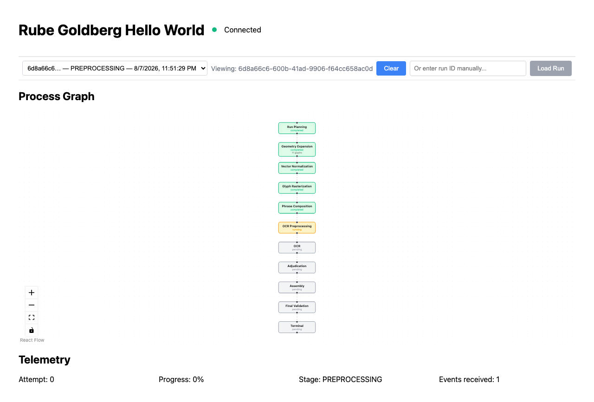
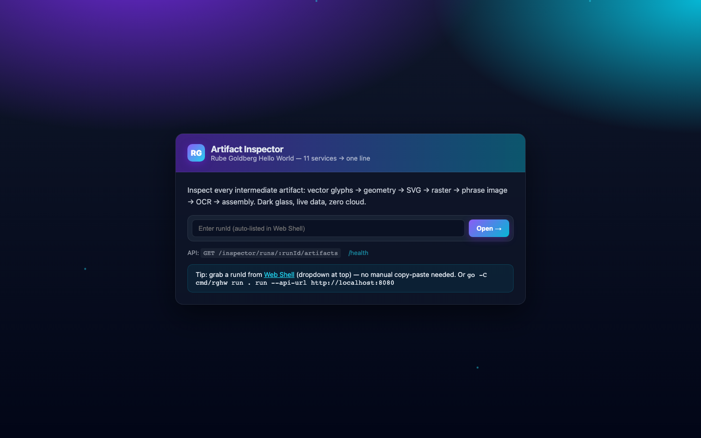
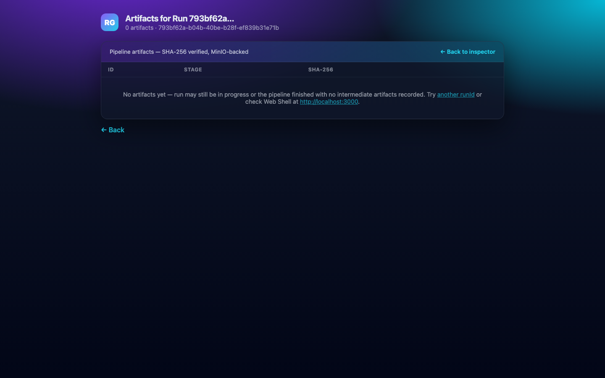
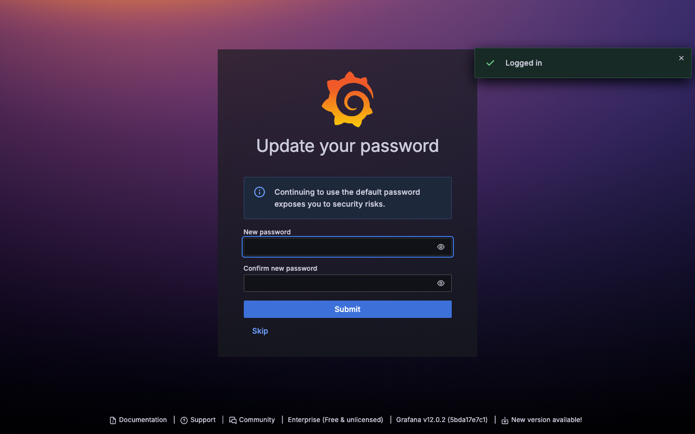

# Runbook

Operational guide for bringing up, running, and observing the Rube Goldberg Hello World stack on one laptop. The authoritative design is [docs/architecture.md](architecture.md) and the milestone status is [docs/implementation-status.md](implementation-status.md). For how to **use** the Web UIs and apps once they are up, see [User Guide](user-guide.md).

> **Quickest start:** `./rghw.sh` on Linux/macOS or `.\rghw.bat` on Windows — one command brings up k3d, builds images, applies infra, waits for pods, starts port-forwards for every web UI, runs `rghw run` (`HELLO WORLD`), and prints a URL table (see `./rghw.sh --help` / `./rghw.sh --dry-run`). This runbook documents the manual steps the scripts automate.

## 1. Overview

The system derives `HELLO WORLD` through a pipeline:

```text
CLI (Go rghw) -> Orchestrator (Kotlin) -> Glyph Catalog (Java/SOAP)
  -> Geometry (C++) -> Vector Normalizer (Go) -> Rasterizer (C#/gRPC)
  -> Image Pipeline (Python) -> OCR Worker (Node) -> Adjudicator (Ruby)
  -> Phrase Assembler (Rust) -> SSE -> CLI prints HELLO WORLD
```

Every primary artifact increases maturity `0 -> 10 -> ... -> 100`. All large payloads live in MinIO, Kafka carries only references. The stack runs in Kubernetes namespace `rube-goldberg` on a k3d cluster `rube-goldberg` with a local registry at `localhost:5001`.

## 2. System requirements & OS support

### 2.1 Hardware — what you need on one laptop

The stack is 25 pods (19 app + 6 platform) plus a 3-node Kafka KRaft ring — all on one k3d node. Budgets are from `docs/architecture.md §21.5` and live measurements (`kubectl top` on 2026-08-08, idle).

| Resource | Recommended | Minimum (low-memory profile) | Measured idle / build |
| --- | --- | --- | --- |
| **RAM** | 16 GiB (8 GiB to `colima`/`k3d`) | 8 GiB host, 4 GiB to `colima` (`--memory 4`) | `~1.8 GiB` pods idle |
| **CPU** | 4 vCPU (`--cpu 4`) | 2 vCPU — slower, OCR may retry | 25 pods, ~200m idle, ~400m burst |
| **Disk — free before first `make images`** | **40 GiB** | 20 GiB free if you `docker system prune -a` after | `docker system df` 2026-08-08: Images `21.42GB` (57 images, `9.27GB` reclaimable), Local Volumes `17.66GB`, repo `3.6GB` |
| **Disk — k3d/Colima volume** | `--disk 40` (macOS) / 40 GiB Docker Desktop (Windows) | `--disk 20` — will hit `DiskPressure` faster | `infra/k3d/cluster.yaml` is 1 server, 0 agents — no HA |

Target full-stack working set: **`5–8 GiB`** per architecture §21.5 (Kafka `512Mi→1Gi`, Postgres `256→512Mi`, Redis `64→192Mi`, MinIO `128→384Mi`, Prometheus `256→512Mi`, Loki `128→384Mi`, Tempo `128→384Mi`, Grafana `128→256Mi`, OTel `64→256Mi`, JVM `128→384Mi` each, Go/Rust `32→64Mi→192Mi`, OCR `256→768Mi`, Python `128→512Mi`, .NET `128→384Mi`). Retention intentionally small, 1 replica each.

For 4 GiB laptops:

```bash
colima start --cpu 2 --memory 4 --disk 20   # or Docker Desktop → Settings → Resources → 4 GiB
make demo PROFILE=low-memory
# or manually
bash scripts/low-memory-profile.sh  # patches deployments to 256Mi limits, fewer workers
kubectl rollout restart deployment -n rube-goldberg --all
make wait
```

Expect slower OCR and occasional `OOMKilled` — raise that service's limit in `infra/k8s/...` if seen. See §4.3 and `scripts/low-memory-profile.sh`.

### 2.2 OS support — Mac, Linux, Windows

| OS | Primary path (recommended) | Fallback | Notes |
| --- | --- | --- | --- |
| **macOS 13+** (Intel & Apple Silicon M1-M3) | `./rghw.sh` + Colima | Docker Desktop for Mac | `colima start --cpu 4 --memory 8 --disk 40` before `make cluster`; Homebrew provides `k3d`, `kubectl`, `helm`, `terraform`, `go`, `librdkafka` (`brew install k3d kubectl helm terraform go librdkafka`) |
| **Linux** (Ubuntu 22.04+, Fedora 40+) | `./rghw.sh` | — | Docker CE + `k3d` install script; `sudo apt install k3d kubectl helm terraform golang librdkafka-dev` (see `versions.env` pins) |
| **Windows 10/11** | `.\rghw.bat` → **Git Bash** → `bash rghw.sh` | `.\rghw.bat` native (`cmd.exe` + `make` via `choco install make golang` or WSL2) | **Requires** Docker Desktop + WSL2 backend, `k3d`/`kubectl`/`helm`/`terraform` Windows binaries on `PATH`, Git Bash (comes with Git for Windows) or WSL2 Ubuntu. The bat delegates to `bash rghw.sh %*` when `bash` is found, so `--quiet`, `--fresh`, `--skip-images`, `--timeout`, `--api-url` all work identically on Windows. Without Git Bash, the bat uses `make` directly (`make cluster` etc.) and `start /B kubectl port-forward`. |

Common Windows gotchas:

* **Make not found** — install via `choco install make` or use WSL2 (`wsl make cluster`). Prefer Git Bash where `make` from `choco` is on `PATH`.
* **`lsof` missing** — optional; `rghw.sh` checks `command -v lsof` before killing stale forwards, so Windows without `lsof` just skips that step.
* **Line endings** — repo is `LF` (`core.autocrlf=false` recommended: `git config --global core.autocrlf input` on Windows).
* **Host file for ingress** — `C:\Windows\System32\drivers\etc\hosts` needs `127.0.0.1 rghw.localhost grafana.rghw.localhost minio.rghw.localhost` only if you use ingress; port-forward mode needs no edit.
* **CRLF scripts** — `scripts/prerequisites.sh` and `rghw.sh` are `LF` with `#!/usr/bin/env bash`; run them from Git Bash/WSL, not double-click in Explorer.

### 2.3 Toolchains — pinned versions

Install these before the first run. `make prerequisites` checks each and installs language-level deps. All versions are pinned in `versions.env` (no floating `latest`).

| Tool | Version | Purpose |
| --- | --- | --- |
| Docker runtime | Colima `0.10.3` (macOS) or Docker Desktop `29.7+` (Linux/Win) | containers + k3d |
| k3d | `5.9.0` | local k3s cluster (`infra/k3d/cluster.yaml`) |
| kubectl | `1.36.3` | cluster control |
| helm | `4.2.3` | chart rendering (via Terraform) |
| terraform | `1.15.8` | infra provisioning (`infra/terraform/environments/local`) |
| Go | `1.26.5` | `cmd/rghw`, `services/vector-normalizer-go` |
| Rust | `1.97.1` (`rust-toolchain.toml`) | `services/phrase-assembler-rust` |
| Node.js | `26.6.0` / `24 LTS` (`.nvmrc`) | `services/ocr-worker-node`, `services/event-gateway-node`, `services/telemetry-element` |
| Python | `3.14.6` | `services/image-pipeline-python` |
| Ruby | `4.0.6` (`.ruby-version`) | `services/adjudicator-ruby`, `services/artifact-inspector-ruby` |
| Java | `25` | `services/glyph-catalog-java` (Maven `3.9.16`/Spring) |
| .NET | `10.0.302` (`global.json`) | `services/rasterizer-dotnet` |
| Kotlin/JVM | JDK `21` + Gradle `9.6.1` wrapper | `services/run-orchestrator-kotlin` |
| C++ | `clang-format 22.1.8` + `cmake 4.4.2` + `librdkafka 2.15.0` / `2.3.0-1build2` Ubuntu | `services/geometry-engine-cpp` |

```bash
make prerequisites   # toolchain check + npm ci / bundle install / venv
```

Missing toolchains are skipped with a warning; `STRICT=1` makes them hard failures (CI always runs `STRICT=1`). Run `make format` before `make lint`; both must pass per `AGENTS.md`.

Windows install hints:

```powershell
# via Chocolatey (PowerShell Admin)
choco install docker-desktop k3d kubernetes-cli kubernetes-helm terraform golang nodejs python ruby openjdk dotnet-sdk
# or via winget
winget install Docker.DockerDesktop k3d K3d Kubernetes.kubectl Helm.Helm Hashicorp.Terraform Go.Go OpenJS.NodeJS
# then Git Bash
git clone https://github.com/HyperVon/rg-helloworld.git && cd rg-helloworld && bash rghw.sh --help
```

## 3. Host names and ingress

`docs/architecture.md §21.4` defines ingress hostnames. The k3d cluster in `infra/k3d/cluster.yaml` disables Traefik, so ingress is optional. Two access modes are supported:

### 3.1 Ingress mode (if you install ingress-nginx)

Add to `/etc/hosts`:

```text
127.0.0.1 rghw.localhost grafana.rghw.localhost minio.rghw.localhost
```

Then:

| Ingress | URL | Service |
| --- | --- | --- |
| Web Shell (React Flow) | `http://rghw.localhost/` | `web-shell:80 -> 3000` |
| Orchestrator API | `http://rghw.localhost/api/` | `run-orchestrator:8080` |
| Artifact Inspector (HTMX) | `http://rghw.localhost/inspector/` | `artifact-inspector` |
| Grafana | `http://grafana.rghw.localhost/` | `grafana:3000` |
| MinIO Console | `http://minio.rghw.localhost/` | `minio:9000` |

CLI defaults to <http://rghw.localhost/api> (*architecture §21.4*). If ingress is not installed, use **port-forward mode** below — the CLI works either way via `--api-url`.

### 3.2 Port-forward mode (always works, no /etc/hosts)

This is the recommended way on a fresh laptop and what the trajectory `DoD VERIFIED` used:

```bash
# orchestrator (required for rghw run)
kubectl port-forward -n rube-goldberg svc/run-orchestrator 8080:8080 &
# web UIs (svc port is 80 for web-shell, artifact-inspector, event-gateway, grafana)
kubectl port-forward -n rube-goldberg svc/web-shell 3000:80 &
kubectl port-forward -n rube-goldberg svc/event-gateway 8081:80 &
kubectl port-forward -n rube-goldberg svc/artifact-inspector 3001:80 &
kubectl port-forward -n rube-goldberg svc/grafana 3002:80 &
kubectl port-forward -n rube-goldberg svc/prometheus 9090:9090 &
kubectl port-forward -n rube-goldberg svc/loki 3100:3100 &
kubectl port-forward -n rube-goldberg svc/tempo 3200:3200 &
kubectl port-forward -n rube-goldberg svc/minio 9000:9000 &
```

Then use `rghw run --api-url http://localhost:8080` (or `make run` which does this by default).

## 4. Full bring-up (first time)

### 4.1 One-command demo

```bash
make prerequisites
make cluster       # k3d cluster + registry localhost:5001 (idempotent, reuses existing)
make images        # build + push all images to localhost:5001 (milestone5..11 tags)
make infra         # terraform init + apply (namespace, secrets, helm releases, PVCs)
make deploy        # kubectl apply infra/k8s/milestone*/ (if not already via terraform)
make wait          # wait-ready.sh ignores terminal Succeeded/Failed pods and prints diagnostics
make demo          # wait + scripts/smoke-test.sh (Kafka + MinIO + rghw run)
```

`make demo` is defined as `wait` + `scripts/smoke-test.sh` (*Makefile:461, architecture §25*). The full first-time sequence from `architecture §4.1` is `prerequisites -> contracts -> build -> images -> cluster -> infra -> wait -> e2e`.

### 4.2 Step-by-step explanation

| Step | Command | What it does | How to verify |
| --- | --- | --- | --- |
| 1 | `make prerequisites` | Runs `scripts/prerequisites.sh`: checks every toolchain, creates `.venv`, runs `npm ci`, `bundle install`, `cargo fetch` | No `SKIP` warnings (or `STRICT=1` passes) |
| 2 | `make cluster` | `scripts/k3d-create.sh` creates k3d cluster `rube-goldberg` per `infra/k3d/cluster.yaml` (1 server, 0 agents, registry `rghello-registry:5001`), waits for `kubectl wait --for=condition=ready pod --all -A --timeout=180s` | `k3d cluster list` shows `rube-goldberg`, `kubectl cluster-info` |
| 3 | `make images` | `scripts/build-images.sh` builds 12 images (`glyph-catalog:milestone5`, `geometry-engine:milestone5`, `run-orchestrator:milestone6`, `vector-normalizer:milestone6`, `rasterizer:milestone6`, `image-pipeline:milestone7`, `ocr-worker:milestone8`, `adjudicator:milestone8`, `phrase-assembler:milestone9`, `event-gateway:milestone11`, `telemetry-element:milestone11`, `artifact-inspector:milestone11`, `web-shell:milestone11`) and pushes to `localhost:5001` | `docker images` (filter `5001`) |
| 4 | `make infra` | `cd infra/terraform/environments/local && terraform init && terraform apply -auto-approve` provisions namespace `rube-goldberg`, secrets (`postgres-credentials`, `redis-credentials`, `minio-credentials`, `grafana-credentials`), Helm releases (PostgreSQL 18.8.6, Kafka KRaft, Redis, MinIO, Prometheus, Loki, Tempo), PVCs | `terraform show`, `helm list -n rube-goldberg` |
| 5 | `make deploy` | Applies hand-written manifests under `infra/k8s/` (deployments, services, jobs, cronjobs, network policies, Grafana dashboards) | `kubectl get deployments -n rube-goldberg` |
| 6 | `make wait` | `scripts/wait-ready.sh`: waits for non-terminal pods and excludes `Succeeded`/`Failed` jobs, with diagnostics on timeout | All live pods `1/1 Running`; completed or failed terminal jobs do not block readiness |
| 7 | `make run` or `rghw run` | Starts a run (see §5) | `HELLO WORLD` on stdout, 0 exit |

If you already have a cluster, `make cluster` is idempotent ("already exists; reusing it"). Rebuild only what changed — `scripts/build-images.sh` can be run per-image during iteration. `make deploy` restarts the application deployments after applying manifests so rebuilt immutable local image tags are pulled, then waits for rollout and readiness.

### 4.3 Low-memory mode (4 GiB laptop)

```bash
make demo PROFILE=low-memory
# or manually
bash scripts/low-memory-profile.sh  # patches all deployments to 256Mi limits, fewer workers
kubectl rollout restart deployment -n rube-goldberg --all
make wait
```

This retains all required technologies but lowers retention, scrape frequency, and Kafka log segments (*architecture §26.3*).

## 5. Running the pipeline (`rghw run`)

### 5.1 CLI basics

The CLI is `cmd/rghw` (`go run ./cmd/rghw` or `rghw` after `go install`). It talks REST to the orchestrator and streams SSE.

```bash
rghw run
rghw run --message "HELLO WORLD"          # default, explicit form
rghw run --api-url http://localhost:8080  # port-forward mode
rghw run --api-url http://rghw.localhost/api  # ingress mode (default)
rghw run --timeout 3m --quiet             # suppress stderr progress
rghw run --open-ui                        # open browser dashboard
rghw run --retain-artifacts               # keep MinIO artifacts after run
rghw run --json                           # machine-readable result
rghw run --run-id <uuid>                  # reattach to existing run
```

`make run` is shorthand for `cd cmd/rghw && go run . run --api-url "http://localhost:8080"` (*Makefile:459*).

### 5.2 Standard-stream contract (architecture §4.3)

Strictly enforced:

* **stderr**: progress `[01/10] Creating run...` through `[10/10] Assembling UTF-8`, warnings, URLs, run IDs
* **stdout**: exactly one line `HELLO WORLD` + newline on success; nothing on failure
* Enables: `RESULT="$(rghw run)"; test "$RESULT" = "HELLO WORLD"`

Normal stderr:

```text
[01/10] Creating run...
[02/10] Planning glyphs...
[03/10] Expanding geometric primitives...
[04/10] Normalizing vectors...
[05/10] Rasterizing glyphs...
[06/10] Composing phrase image...
[07/10] Preparing OCR image...
[08/10] Running OCR...
[09/10] Adjudicating symbols...
[10/10] Assembling UTF-8 output...
```

### 5.3 Exit codes (architecture §4.2)

| Code | Meaning |
| --- | --- |
| 0 | Successful output |
| 1 | Unexpected system failure |
| 2 | Invalid request |
| 3 | Timeout (`--timeout 3m` default) |
| 4 | OCR failed after all quality retries |
| 5 | Final output did not equal requested message |
| 130 | User cancellation (Ctrl-C) |

### 5.4 Verifying a run without the CLI

```bash
# via orchestrator health
curl -sf http://localhost:8080/healthz

# via Kubernetes logs
kubectl logs -n rube-goldberg deploy/run-orchestrator --tail=100
kubectl logs -n rube-goldberg deploy/phrase-assembler --tail=50 | grep assembledText

# via MinIO artifact
kubectl port-forward -n rube-goldberg svc/minio 9000:9000 &
mc alias set local http://localhost:9000 minioadmin minioadmin
mc ls -r local/rube-goldberg-artifacts
```

## 6. Web UIs and observability

All UIs are namespace `rube-goldberg`. The stack includes 4 Grafana dashboards (§20.4), Prometheus metrics, Loki logs, Tempo traces, and OTel Collector.

### 6.1 UI catalog

| UI | Ingress URL | Port-forward (svc port 80 where noted) | What you see | Tech |
| --- | --- | --- | --- | --- |
| **Web Shell** (primary) | `http://rghw.localhost/` | `kubectl port-forward svc/web-shell 3000:80` → `http://localhost:3000` — auto-lists runs via `GET /api/v1/runs`, auto-selects latest, dropdown + manual input | React Flow process graph of the pipeline, run state, maturity progression `0→100`, SSE live updates (see §6.1.1) | React + Vite + React Flow (`services/web-shell`, `infra/k8s/milestone10/web-shell.yaml:22` image `rghello-registry:5001/web-shell:milestone11`) |
| **Telemetry Panel** | embedded in Web Shell | same as web-shell | Run ledger, numeric telemetry, `rg_runs_total`, `rg_step_duration_seconds` | Angular Elements `<rg-telemetry-panel>` (`services/telemetry-element`, `web/telemetry-angular`) |
| **Artifact Inspector** | `http://rghw.localhost/inspector/runs/{runId}` | `kubectl port-forward svc/artifact-inspector 3001:80` → `http://localhost:3001` (landing at `/` shows form, then `/inspector/runs/{runId}`) | HTMX-rendered intermediate images (glyph blueprints, geometry JSON, SVG, raster PNG, phrase image), metadata, SHA-256 lineage; view links use stable opaque descriptor IDs and the orchestrator's run-scoped MinIO byte proxy | Ruby + HTMX (`services/artifact-inspector-ruby`, `GET /` and `/inspector` now show a form) |
| **Event Gateway (SSE)** | `http://rghw.localhost/api/v1/runs/{runId}/stream` | `kubectl port-forward svc/event-gateway 8081:80` → `http://localhost:8081/health` → `{"status":"ok"}`; stream also via orchestrator `http://localhost:8080/api/v1/runs/{runId}/stream` | Raw Server-Sent Events: snapshot + heartbeats every 15s, `Last-Event-ID` replay, closes after terminal event (§19.5) | TypeScript (`services/event-gateway-node`, Redis Streams) + Kotlin orchestrator stream |
| **Grafana** | `http://grafana.rghw.localhost/` | `kubectl port-forward svc/grafana 3002:80` → `http://localhost:3002` (→ `/login`) | 4 provisioned dashboards (see §6.2), Explore for Prometheus/Loki/Tempo | Grafana Enterprise 12.0.2 (`infra/k8s/milestone11/grafana.yaml`) |
| **Prometheus** | — | `kubectl port-forward svc/prometheus 9090:9090` → `http://localhost:9090`/-/healthy → `Prometheus Server is Healthy` | Metrics: `rg_runs_total{status}`, `rg_active_runs`, `rg_step_*`, `rg_kafka_consumer_lag`, `rg_ocr_confidence` (§20.2) | Prometheus 3.5.0 |
| **Loki** | — | `kubectl port-forward svc/loki 3100:3100` → `http://localhost:3100`/ready → `ready` | JSON structured logs from every service (§20.3) | Grafana Loki 3.5.2 |
| **Tempo** | — | `kubectl port-forward svc/tempo 3200:3200` → `http://localhost:3200`/status | Distributed traces: one `rube-goldberg.run` root span per run with children `orchestrator.create-run`, `soap.plan-phrase`, `kafka.produce/consume`, `geometry.expand`, `grpc.render-glyph`, `image.compose`, `ocr.*`, `adjudicate.symbol`, `assemble.phrase` (§20.1) | Grafana Tempo 2.4.0 (minimal local backend `/tmp/tempo/blocks`) |
| **OTel Collector** | — | `kubectl port-forward svc/otel-collector 4317:4317` (gRPC) / 4318 (HTTP) | Telemetry intake, `Everything is ready` (0.91.0), forwards to Prometheus/Tempo/Loki | OTel Collector (`infra/k8s/milestone11/otel-collector.yaml`) |
| **MinIO Console** | `http://minio.rghw.localhost/` | `kubectl port-forward svc/minio 9000:9000` (API) / 9001 (console if enabled) → `http://localhost:9000` | Bucket `rube-goldberg-artifacts`, artifact MinIO keys, SHA-256 verification | MinIO |
| **PostgreSQL** | — | `kubectl port-forward svc/postgresql 5432:5432` → `psql -h localhost -U postgres` | Run projections, expected-codepoint table (restricted to orchestrator role) | PostgreSQL |
| **Redis** | — | `kubectl port-forward svc/redis-master 6379:6379` → `redis-cli` | Redis Streams `rg:run:{runId}:events` backing SSE | Redis |

#### 6.1.1 Web Shell — auto-select and screenshots

The Web Shell no longer requires manual Run ID entry. On load it:

1. `GET http://localhost:8080/api/v1/runs` (or `GET /api/v1/runs` via ingress) — lists recent runs, newest first
2. Auto-selects the latest run (also restores `localStorage.rghw:lastRunId`) — shows the React Flow graph immediately
3. Populates a dropdown of recent runs; the manual text field remains as a fallback

Screenshots (captured via Playwright `chromium` against `http://localhost:3000` and `http://localhost:3001` after `make images && make deploy && rghw run`):

**Web Shell — auto-selected run (PREPROCESSING stage, events streaming):**

*Header shows “Connected”, dropdown `6d8a66c6… — PREPROCESSING — 8/7/2026`, “Viewing: <full runId>”, `Clear`, and manual input. Process Graph shows `Run Planning` through `Phrase Composition` as `completed` (green), `OCR Preprocessing` as `running` (yellow), downstream as `pending`. Telemetry shows `Stage: PREPROCESSING`, `Events received: 1`.*

**Web Shell — same view (full page):**


**Artifact Inspector — landing (no runId yet):**

*GET `/` and `/inspector` now render a form: “Enter runId (e.g. from rghw run output)” → `Open` navigates to `/inspector/runs/{runId}`. This replaces the previous `404 Sinatra doesn’t know this ditty` for `http://localhost:3001`.*

**Artifact Inspector — run view (empty until OCR completes):**


**Grafana — login (provisioned, port-forward 3002:80):**


**Prometheus — healthy:**

`curl http://localhost:9090/-/healthy` → `Prometheus Server is Healthy`

**Loki — ready:**

`curl http://localhost:3100/ready` → `ready`

**MinIO — live:**

`curl http://localhost:9000/minio/health/live` → `200 OK`

### 6.2 Grafana credentials and dashboards

Grafana admin password is in Kubernetes Secret `grafana-credentials` key `admin-password`:

```bash
kubectl get secret grafana-credentials -n rube-goldberg -o jsonpath='{.data.admin-password}' | base64 -d; echo
# username is admin
```

Data sources are auto-provisioned (`infra/k8s/milestone11/grafana-provisioning.yaml`): Prometheus `http://prometheus:9090`, Loki `http://loki:3100`, Tempo `http://tempo:3200`.

Four dashboards (§20.4):

1. **Rube Goldberg Overview** — active runs, success/failure, end-to-end duration, stage duration, retry count, Kafka lag, artifact bytes, OCR confidence histogram
2. **Run Deep Dive** (variable `trace_id`) — trace timeline, service graph (via Tempo metrics-generator), correlated logs, stage table, artifact timeline
3. **OCR Laboratory** — OCR confidence by attempt, quality-rejection count, render profile vs confidence, preprocessing foreground ratio
4. **Ridiculous Infrastructure** — pod CPU/memory, restarts, Kafka health, PostgreSQL connections, Redis stream length, MinIO storage, Loki/Tempo/OTel queue

Provisioned via ConfigMaps `grafana-dashboards` and `grafana-provisioning` (`infra/k8s/milestone11/grafana.yaml:38`).

### 6.3 Quick UI smoke check

```bash
# all UIs responding (port-forward mode)
curl -sf http://localhost:3000/ | head -5        # web-shell: contains "Rube Goldberg Hello World"
curl -sf http://localhost:8081/healthz           # event-gateway
curl -sf http://localhost:3002/api/health | jq . # grafana -> {"database":"ok","version":"12.0.2"}
curl -sf http://localhost:9090/-/healthy         # prometheus -> Prometheus Server is Healthy
curl -sf http://localhost:3100/ready             # loki -> ready
curl -sf http://localhost:3200/status | head -20 # tempo -> server listening http [::]:3200
kubectl logs -n rube-goldberg deploy/otel-collector | grep "Everything is ready"
```

For ingress mode, replace `localhost:3000` with `rghw.localhost`, `localhost:3002` with `grafana.rghw.localhost`, etc.

### 6.4 SSE streaming details

The event gateway replays missed events via `Last-Event-ID` and sends a full snapshot first (*architecture §19.5*). To test:

```bash
# start a run and capture its ID from stderr
rghw run --api-url http://localhost:8080 2> /tmp/run.log
RUN_ID=$(grep -oE '[0-9a-f-]{36}' /tmp/run.log | head -1)
# stream via gateway directly
curl -N -H "Accept: text/event-stream" http://localhost:8081/api/v1/runs/$RUN_ID/stream
```

## 7. Development modes

### 7.1 Full mode (acceptance)

All services in-cluster. This is what `make demo` and the `DoD VERIFIED` trajectory (25 pods `Running`) use. Required for `rghw run` acceptance.

### 7.2 Focused service mode (architecture §26.2)

Run one service outside Kubernetes while dependencies stay in-cluster:

```bash
make port-forward   # forwards kafka, postgres, redis, minio locally
make dev-service SERVICE=geometry-engine
make dev-service SERVICE=ocr-worker
```

Override endpoints via env vars (e.g., `KAFKA_BOOTSTRAP_SERVERS=localhost:9092`, `REDIS_URL=localhost:6379`).

### 7.3 Low-memory mode

Already covered in §4.3. After `scripts/low-memory-profile.sh`, verify:

```bash
kubectl get pods -n rube-goldberg
kubectl top pods -n rube-goldberg  # if metrics-server is installed
```

## 8. Verification

```bash
make format          # no diff
make lint            # all linters pass (STRICT=1 in CI)
make unit            # all service unit tests
make coverage        # 90% gate per language (Go 100%, Rust 97%, etc.)
make build           # compile everything
make integration     # 11 banners, no prohibited fields
make e2e             # gates + integration; use E2E_SKIP_PLATFORM=1 to skip k8s
make chaos           # kill rasterizer mid-run → run still succeeds (Milestone 12)
make diagnostics     # scripts/collect-diagnostics.sh → .local/diagnostics/
```

E2E primary assertion: `OUTPUT="$(rghw run --quiet)"; test "$OUTPUT" = "HELLO WORLD"` (§27.5).

## 9. Recovering from partial infrastructure state

### Pods stuck in CrashLoopBackOff

```bash
kubectl get pods -n rube-goldberg
kubectl logs -n rube-goldberg pod/<pod-name> --previous
kubectl rollout restart deployment/<deployment-name> -n rube-goldberg
```

DiskPressure is the common cause on 40 GiB Colima disks. Fix:

```bash
docker image prune -af          # reclaim 6+ GiB (trajectory used 21.5 GiB images)
kubectl delete pod -n rube-goldberg --field-selector=status.phase=Failed
docker restart k3d-rube-goldberg-server-0
kubectl get nodes -o wide | grep DiskPressure  # expect False
kubectl get pods -n rube-goldberg  # expect 19-25 Running
```

### Kafka broker unavailable

```bash
kubectl get pods -n rube-goldberg -l app=kafka
kubectl describe pod -n rube-goldberg <kafka-pod-name>
# If healthy but unreachable, restart:
kubectl rollout restart statefulset/kafka-controller -n rube-goldberg
```

Kafka rebalancing loops (high rebalance rate) — wait 60s or restart with fresh group:

```bash
kubectl rollout restart deployment/adjudicator deployment/ocr-worker -n rube-goldberg
```

### MinIO bucket missing

```bash
kubectl exec -n rube-goldberg deploy/minio -- mc ls local/rube-goldberg-artifacts
# Recreate if missing:
kubectl exec -n rube-goldberg deploy/minio -- mc mb local/rube-goldberg-artifacts
```

### PostgreSQL connection refused

```bash
kubectl get pods -n rube-goldberg -l app=postgresql
kubectl logs -n rube-goldberg pod/<postgres-pod-name>
kubectl get svc -n rube-goldberg postgresql
# local password is PostgresPassw0rd! (scripts/smoke-test.sh)
PGPASSWORD=PostgresPassw0rd! psql -h localhost -p 5432 -U postgres -c "SELECT 1"
```

### Web shell 404

`artifact-inspector` returns 404 at `/` but serves `/artifacts?runId=...`. `web-shell` serves `assets/index-*.js` at `/` on `10.42.0.168:3000` inside cluster or `localhost:3000` via port-forward. Verify:

```bash
kubectl logs -n rube-goldberg deploy/web-shell
curl -sf http://localhost:3000/ | grep -i "rube goldberg"
```

## 10. Diagnostics collection

```bash
# pod logs for all services
kubectl logs -n rube-goldberg -l app=run-orchestrator > /tmp/orchestrator.log
kubectl logs -n rube-goldberg -l app=ocr-worker > /tmp/ocr-worker.log
kubectl logs -n rube-goldberg -l app=adjudicator > /tmp/adjudicator.log
kubectl logs -n rube-goldberg -l app=phrase-assembler > /tmp/phrase-assembler.log
kubectl logs -n rube-goldberg -l app=grafana --tail=100
kubectl logs -n rube-goldberg -l app=tempo --tail=50 | grep "Tempo started"
kubectl logs -n rube-goldberg -l app=otel-collector | grep "Everything is ready"

# Kafka consumer lag
kubectl exec -n rube-goldberg kafka-controller-0 -c kafka -- kafka-consumer-groups.sh \
  --bootstrap-server localhost:9092 --describe --group phrase-assembler-v1

# Redis stream
kubectl exec -n rube-goldberg deploy/redis-master -- redis-cli XLEN rg:run:<runId>:events
kubectl exec -n rube-goldberg deploy/redis-master -- redis-cli XINFO STREAM rg:run:<runId>:events

# MinIO inventory
kubectl exec -n rube-goldberg deploy/minio -- mc ls -r local/rube-goldberg-artifacts

# PostgreSQL
kubectl exec -n rube-goldberg deploy/postgresql -- psql -U postgres -c "SELECT * FROM pg_stat_activity;"
kubectl exec -n rube-goldberg deploy/postgresql -- psql -U postgres -c "SELECT * FROM runs ORDER BY created_at DESC LIMIT 5;"

# Observability
curl -sf http://localhost:3002/api/health
curl -sf http://localhost:9090/-/healthy
curl -sf http://localhost:3100/ready
curl -sf http://localhost:3200/status

# Full diagnostics archive
make diagnostics  # -> .local/diagnostics/
bash scripts/collect-diagnostics.sh
```

## 11. Tear down

```bash
make down        # scripts/k3d-delete.sh: deletes k3d cluster rube-goldberg (preserves Terraform state)
make destroy     # cd infra/terraform/environments/local && terraform destroy -auto-approve (requires k3d up)
```

Order matters: run `make down` before `make destroy` to avoid k3d/Terraform state conflicts. `make down` is safe to run repeatedly; `make destroy` removes PVCs and secrets.

To clean local build artifacts only:

```bash
make clean       # removes .local/build, gradle build, mvn clean, cargo clean, etc.
```

## 12. References

* Architecture: [docs/architecture.md](architecture.md) (esp. §4 CLI, §20 Observability, §21 Kubernetes, §25 Orchestration, §26 Development Modes, §27 Testing)
* Status: [docs/implementation-status.md](implementation-status.md)
* Troubleshooting: [docs/troubleshooting.md](troubleshooting.md)
* Artifact lineage: [docs/artifact-lineage.md](artifact-lineage.md)
* Infra: [infra/README.md](../infra/README.md), [infra/k3d/cluster.yaml](../infra/k3d/cluster.yaml), [infra/terraform/environments/local](../infra/terraform/environments/local)
* Web: [web/README.md](../web/README.md)
* CLI: [cmd/rghw/README.md](../cmd/rghw/README.md)
* ADRs: [docs/adr/](../adr/)
